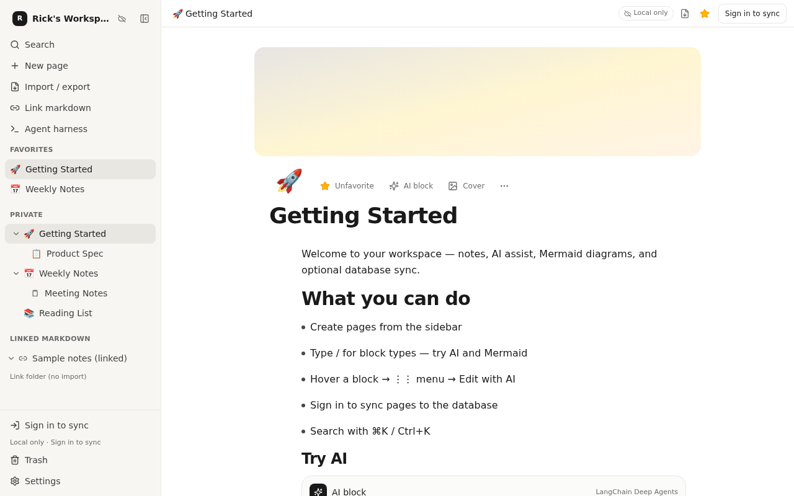
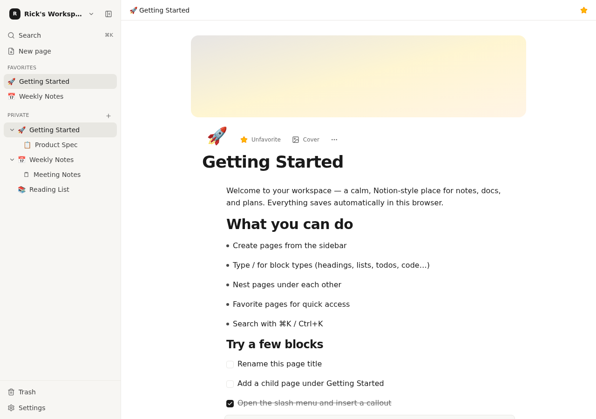
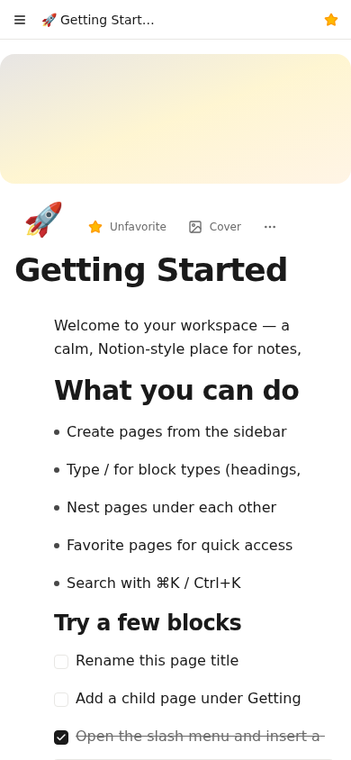
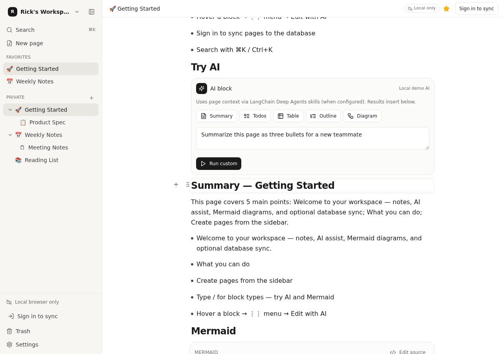
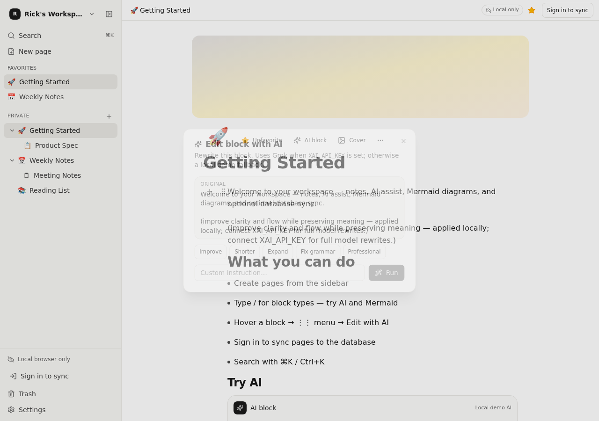
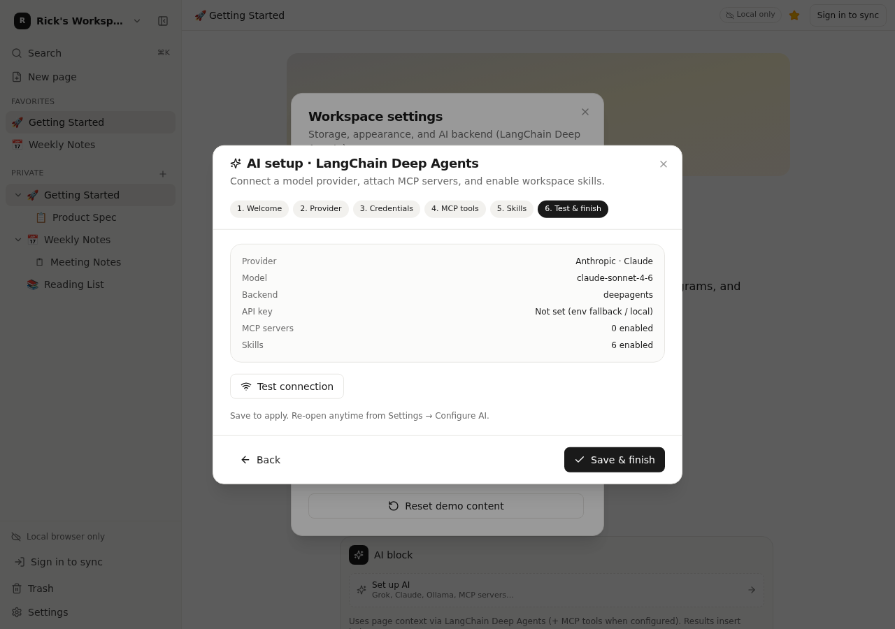
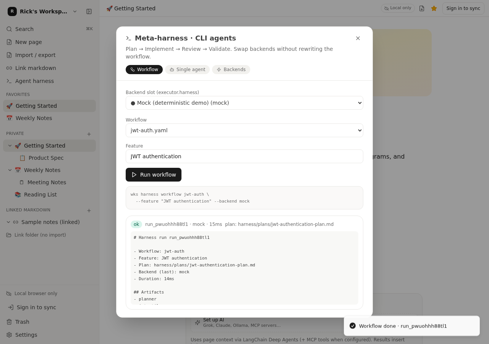

# ForgeNotes

**ForgeNotes** is a Notion-style notes app with a block editor, nested pages, AI (Deep Agents + coding CLIs), markdown link/import/export, Postgres-backed search & sync, a meta-harness for agent workflows, and optional **Tauri desktop** packaging.

Built with React, TanStack Start, Tailwind, PGLite/Postgres, LangChain Deep Agents, and Tauri 2.

<p align="center">
  
</p>

---

## Screenshots

### Desktop workspace

Notion-style sidebar with favorites, nested pages, linked markdown, and an inline AI block.



### Mobile

Clean page view on a small screen — same blocks and covers, hamburger navigation.

<p align="center">
  
</p>

### AI in the editor

Generate summaries, todos, tables, outlines, and diagrams from page context (Deep Agents + skills).



Rewrite any block with Improve / Shorter / Expand / Fix grammar, or a custom instruction.



### AI setup wizard

Connect providers (Claude, Grok, OpenAI, Ollama…), credentials, MCP tools, and workspace skills.



### Agent meta-harness

Run Plan → Implement → Review → Validate workflows from the UI; swap backends without rewriting the workflow.



---

## Documentation

| Doc | What it covers |
|-----|----------------|
| **[FEATURES.md](./FEATURES.md)** | Complete feature list (editor, AI, markdown, search, harness, desktop, …) |
| **[USER_GUIDE.md](./USER_GUIDE.md)** | How to use the product and configure AI, MCP, CLIs, markdown, and sync |
| **[DEVELOPERS.md](./DEVELOPERS.md)** | Local setup, scripts, architecture, build, deploy, and Tauri |
| **[TAURI.md](./TAURI.md)** | Standalone desktop packaging (Windows / macOS / Linux) |
| **[harness/README.md](./harness/README.md)** | Meta-harness CLI, YAML agents, and workflows |

---

## Quick start

```bash
npm install
npm run dev          # http://0.0.0.0:8080
```

| Command | Purpose |
|---------|---------|
| `npm run dev` | Web app (Vite + HMR) |
| `npm run build` | Production web build + DB migrate |
| `npm run typecheck` | TypeScript check |
| `npm run wks -- harness backends` | Meta-harness CLI |
| `npm run tauri:dev` | Desktop window (Tauri + Vite) |
| `npm run tauri:build` | Standalone installers / AppImage / etc. |

See **[DEVELOPERS.md](./DEVELOPERS.md)** for env vars, database, and production notes.  
See **[USER_GUIDE.md](./USER_GUIDE.md)** for day-to-day use (pages, AI, markdown, search, desktop).

---

## What you get (high level)

- **Block editor** — headings, lists, todos, code, callouts, Mermaid, AI blocks
- **Pages** — nested hierarchy, favorites, trash, icons/covers, light/dark theme
- **Persistence** — local browser storage for guests; signed-in **Postgres / PGLite** sync
- **Search** — command palette + Postgres full-text / similarity when DB-backed
- **AI** — Deep Agents + skills, MCP tools, Grok / Claude / OpenAI / Ollama APIs, **Claude Code / Codex / Grok CLIs** with streaming
- **Markdown** — link a folder without importing, import trees, export pages/hierarchies
- **Agent harness** — Plan → Implement → Review → Validate, pluggable backends
- **Desktop** — Tauri standalone (**ForgeNotes** binaries: `.exe`, `.AppImage`, `.dmg`, …)

Full inventory: **[FEATURES.md](./FEATURES.md)**.

---

## Project layout (sketch)

```text
src/
  components/   # UI: editor, sidebar, AI wizard, markdown, harness
  lib/          # store, AI, DB, auth, search, harness, tauri
  routes/       # TanStack Router (app + API)
src-tauri/      # Desktop shell (Tauri 2) — productName: ForgeNotes
harness/        # Agent YAML + workflows + artifacts
cli/            # wks meta-harness entry
migrations/     # SQL (workspace + search)
```

---

## License / status

Private app-builder project. Features evolve with product needs; docs above are the source of truth for current capabilities.
