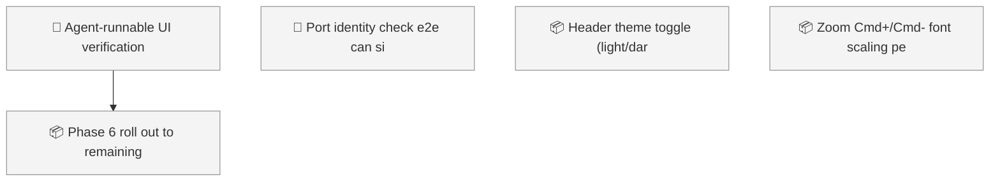
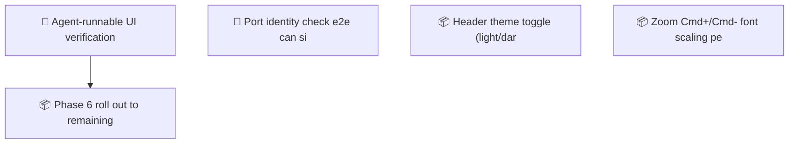

<!-- GENERATED by worklog roadmap-render. DO NOT EDIT. -->

> This file is generated from `.work/todo.jsonl`. Edits will be overwritten.
> To change the roadmap, change the work items: `worklog add|update|close`.

# Roadmap

_1 epic(s) in flight, 4 open item(s), 0 blocked, 0 unclassified._

## Now

_Nothing here._

## Next

### Agent-runnable UI verification loop  ·  P1  ·  6 of 7 done  ·  feature 4 / ops 3
Adopt an agent-runnable UI verification loop for ForgeNotes: a written spec and PlantUML Salt wireframe define intent, the UI is made addressable, and an agent takes a real screenshot of the macOS WKWebView via the Tauri MCP bridge and compares it against the wireframe and a written rubric before calling work done. Covers Vitest, Playwright WebKit, tauri-plugin-mcp-bridge, testability retrofit, screenshot determinism controls, and per-screen specs.

| # | Item | Type | Priority | Status | Blocked by |
|---|---|---|---|---|---|
| [13](https://github.com/SpillwaveSolutions/forge-notes/issues/13) | Phase 6: roll out to remaining screens, make the loop mandatory | story | P2 | todo | — |

### (no epic)

| # | Item | Type | Priority | Status | Blocked by |
|---|---|---|---|---|---|
| 01KZ2HRT | Port identity check: e2e can silently adopt a sibling project's dev server | task | P2 | todo | — |
| 01KZ2JN6 | Header theme toggle (light/dark) | task | P2 | todo | — |
| 01KZ2JN6 | Zoom: Cmd+/Cmd- font scaling, persisted per device | task | P2 | todo | — |

## Later

_Nothing here._

## Milestones

### v0.3.0

| # | Item | Type | Priority | Status | Blocked by |
|---|---|---|---|---|---|
| 01KZ2HRT | Port identity check: e2e can silently adopt a sibling project's dev server | task | P2 | todo | — |
| 01KZ2JN6 | Header theme toggle (light/dark) | task | P2 | todo | — |
| 01KZ2JN6 | Zoom: Cmd+/Cmd- font scaling, persisted per device | task | P2 | todo | — |

## Visual roadmap

### Dependency graph

### Hierarchy

