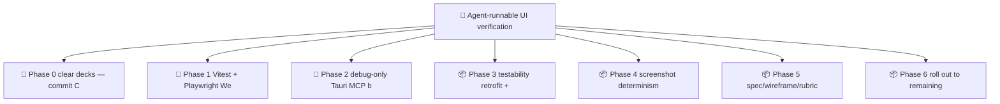

<!-- GENERATED by worklog roadmap-render. DO NOT EDIT. -->

> This file is generated from `.work/todo.jsonl`. Edits will be overwritten.
> To change the roadmap, change the work items: `worklog add|update|close`.

# Roadmap

_1 epic(s) in flight, 7 open item(s), 0 blocked, 0 unclassified._

## Now

_Nothing here._

## Next

### Agent-runnable UI verification loop  ·  P1  ·  0 of 7 done  ·  feature 4 / ops 3
Adopt an agent-runnable UI verification loop for ForgeNotes: a written spec and PlantUML Salt wireframe define intent, the UI is made addressable, and an agent takes a real screenshot of the macOS WKWebView via the Tauri MCP bridge and compares it against the wireframe and a written rubric before calling work done. Covers Vitest, Playwright WebKit, tauri-plugin-mcp-bridge, testability retrofit, screenshot determinism controls, and per-screen specs.

| # | Item | Type | Priority | Status | Blocked by |
|---|---|---|---|---|---|
| 01KYZ8XK | Phase 0: clear decks — commit CLAUDE.md, close out worklog state | story | P1 | todo | — |
| 01KYZ8XK | Phase 1: Vitest + Playwright WebKit foundation | story | P1 | todo | — |
| 01KYZ8XK | Phase 2: debug-only Tauri MCP bridge | story | P1 | todo | — |
| 01KYZ8XM | Phase 3: testability retrofit + login dark-mode fix | story | P1 | todo | — |
| 01KYZ8XM | Phase 5: spec/wireframe/rubric pipeline, piloted on AiSetupWizard | story | P1 | todo | — |
| 01KYZ8XM | Phase 4: screenshot determinism and reveal controls | story | P2 | todo | — |
| 01KYZ8XM | Phase 6: roll out to remaining screens, make the loop mandatory | story | P2 | todo | — |

## Later

_Nothing here._

## Visual roadmap

### Dependency graph

```mermaid
graph TD
    01KYZ8X1X1V76HYNK8B5JYMD9W["🔧 Agent-runnable UI verification"]
    01KYZ8XKMKNZXG4VH7JD53QVJ6["🔧 Phase 0 clear decks — commit C"]
    01KYZ8XKS8JTKW475Z0V18GSYF["🔧 Phase 1 Vitest + Playwright We"]
    01KYZ8XKXZHJ767E31NKS05WPR["🔧 Phase 2 debug-only Tauri MCP b"]
    01KYZ8XM2SCZG43J0MD59P4ZHK["📦 Phase 3 testability retrofit +"]
    01KYZ8XM7DGK443WDFCVJTVC40["📦 Phase 4 screenshot determinism"]
    01KYZ8XMBYBDR7M7V95CZZ63F3["📦 Phase 5 spec/wireframe/rubric"]
    01KYZ8XMGPWDJ8KXXK23KV47NT["📦 Phase 6 roll out to remaining"]
    01KYZ8X1X1V76HYNK8B5JYMD9W --> 01KYZ8XKMKNZXG4VH7JD53QVJ6
    01KYZ8X1X1V76HYNK8B5JYMD9W --> 01KYZ8XKS8JTKW475Z0V18GSYF
    01KYZ8X1X1V76HYNK8B5JYMD9W --> 01KYZ8XKXZHJ767E31NKS05WPR
    01KYZ8X1X1V76HYNK8B5JYMD9W --> 01KYZ8XM2SCZG43J0MD59P4ZHK
    01KYZ8X1X1V76HYNK8B5JYMD9W --> 01KYZ8XM7DGK443WDFCVJTVC40
    01KYZ8X1X1V76HYNK8B5JYMD9W --> 01KYZ8XMBYBDR7M7V95CZZ63F3
    01KYZ8X1X1V76HYNK8B5JYMD9W --> 01KYZ8XMGPWDJ8KXXK23KV47NT
    classDef todo fill:#f4f4f4,stroke:#999999
    class 01KYZ8X1X1V76HYNK8B5JYMD9W,01KYZ8XKMKNZXG4VH7JD53QVJ6,01KYZ8XKS8JTKW475Z0V18GSYF,01KYZ8XKXZHJ767E31NKS05WPR,01KYZ8XM2SCZG43J0MD59P4ZHK,01KYZ8XM7DGK443WDFCVJTVC40,01KYZ8XMBYBDR7M7V95CZZ63F3,01KYZ8XMGPWDJ8KXXK23KV47NT todo
```

### Hierarchy

