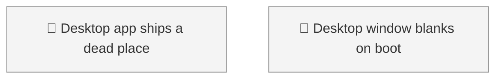
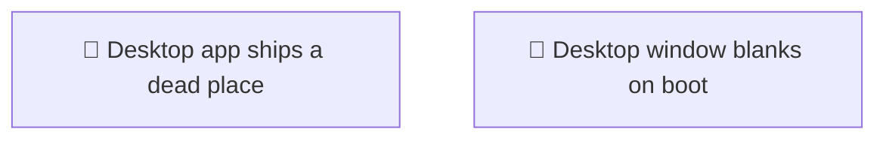

<!-- GENERATED by worklog roadmap-render. DO NOT EDIT. -->

> This file is generated from `.work/todo.jsonl`. Edits will be overwritten.
> To change the roadmap, change the work items: `worklog add|update|close`.

# Roadmap

_0 epic(s) in flight, 2 open item(s), 0 blocked, 0 unclassified._

## Now

_Nothing here._

## Next

### (no epic)

| # | Item | Type | Priority | Status | Blocked by |
|---|---|---|---|---|---|
| 01KZ4D4P | Desktop app ships a dead placeholder — SSR build has no static entry, so the UI never loads | story | P2 | todo | — |
| 01KZ4FQN | Desktop window blanks on boot: Better Auth rejects the tauri:// scheme as a base URL | story | P2 | todo | — |

## Later

_Nothing here._

## Milestones

### v0.3.1

| # | Item | Type | Priority | Status | Blocked by |
|---|---|---|---|---|---|
| 01KZ4D4P | Desktop app ships a dead placeholder — SSR build has no static entry, so the UI never loads | story | P2 | todo | — |
| 01KZ4FQN | Desktop window blanks on boot: Better Auth rejects the tauri:// scheme as a base URL | story | P2 | todo | — |

## Visual roadmap

### Dependency graph

### Hierarchy

