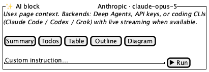
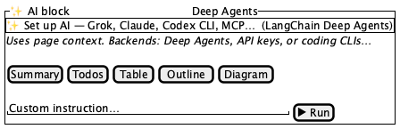
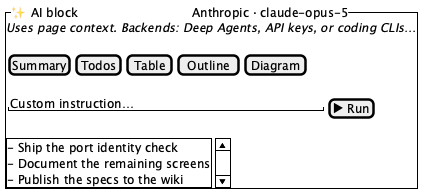

# AI panels

**Source:** `src/components/editor/AiBlockPanel.tsx` (243), `AiSetupBanner` in `ai/AiSetupWizard.tsx:737`
**Reach:** page editor → **AI block** button, or slash menu → **AI**
**States:** 4 — idle, unconfigured (banner), streaming, output

## Spec

Two pieces, both inline rather than modal.

### AiSetupBanner — a conditional element three screens depend on

A dashed-border, full-width button reading **"Set up AI — Grok, Claude, Codex CLI,
MCP… (`<backend label>`)"**, which opens the setup wizard.

**It returns `null` when `setupComplete` is true.** So it is present in a fresh
workspace and gone in a configured one, and it appears in three places —
`AiBlockPanel`, `AiEditDialog` ([dialogs.md](dialogs.md)), and anywhere else the
wizard is reachable inline. Its presence or absence is **always** an Acceptable
Difference; only its *content* is rubric'd, and only when it is showing.

### AiBlockPanel — the `ai` block type, rendered in the page flow

Not a dialog. A `rounded-xl` card on `bg-muted/30` sitting in the block column, so it
is captured as part of the page, and scrolls with it.

Regions, top to bottom:

1. **Header** — a filled 28 px square with a sparkle, the words **AI block**, and the
   resolved provider (or backend label) pushed right at 11 px
2. **`AiSetupBanner`** — conditional, as above
3. **A one-line explainer** naming the backends
4. **Five presets** — Summary · Todos · Table · Outline · Diagram. Each carries a
   `title` tooltip (`Condense the page`, `Extract action items`, `Markdown table`,
   `Hierarchical outline`, `Mermaid flowchart`), so the accessible name is the short
   label and the hint is only a tooltip.
5. **Instruction row** — a resizable `textarea` (`min-h-[64px]`, `resize-y`) and a
   Run/Stop button
6. **Stream panel** — shown while `loading || streamPreview`
7. **Error**, then **output**

### The states are more subtle than they look

- **Run becomes Stop while loading** — same slot, `destructive` variant. Never both.
  Run is disabled until the instruction is non-empty.
- **The stream panel and the output `<pre>` are mutually exclusive.** Output renders
  only `aiOutput && !streamPreview`. During a run you see the stream panel; after it
  clears you see the output block. A capture showing both means that invariant broke.
- **The stream label is three-way**: `status ?? (loading ? "Streaming…" : "Preview")`.
  So a finished-but-not-cleared stream panel reads **Preview** with no spinner.
- Presets differ from `AiEditDialog`'s five (Improve / Shorter / Expand / Fix grammar /
  Professional). Same shape, different verbs — this panel *generates from page
  context*, that one *rewrites one block*.

> **Never rubric a streaming capture.** Model output is nondeterministic by
> construction. Capture idle and final only; the streaming state is specified here in
> prose deliberately, and asserted through the DOM if at all.
>
> The panel renders **its own** `AiSetupWizard`, so the wizard can open on top of the
> page from here — a third entry point beyond Settings and `AiEditDialog`.

## Addressability

| What | Selector |
|---|---|
| Panel | `[data-block-type="ai"]` — the block wrapper |
| Header | text `AI block` |
| Provider | the 11 px span at the header's right |
| Setup banner | `role=button[name=/Set up AI/]` |
| Presets | `role=button[name="Summary"\|"Todos"\|"Table"\|"Outline"\|"Diagram"]` |
| Instruction | `role=textbox` with placeholder `Custom instruction…` |
| Run / Stop | `role=button[name="Run"]` \| `[name="Stop"]` |
| Stream panel | the bordered box containing `Streaming…` \| `Preview` |
| Output | the `pre` after the stream panel clears |
| Error | `.text-destructive` paragraph |

Reach the panel through `[data-block-type="ai"]`, not by text: **AI block** is also the
label of the button in the page-editor action row that creates it.

## Capture recipe

```
1. seed localStorage["forgenotes-ui-freeze"] = "1"
   (+ localStorage["workspace-v1"] = {"state":{"theme":"dark"},"version":0} for dark)
2. load /, viewport 1280x800
3. open a page, click "AI block" in the action row
4. wait for [data-block-type="ai"]
5. webview_screenshot --selector "[data-block-type='ai']"
```

| State | Extra |
|---|---|
| Idle, configured | complete the setup wizard first, or set `setupComplete` |
| Unconfigured | fresh workspace — the banner shows |
| Streaming | do not capture; assert `Streaming…` in the DOM instead |
| Output | run a preset against a configured backend, wait for the stream panel to clear |

The output state needs a **working** backend. There is no mock path here (unlike the
harness), so this is the one screen whose final state cannot be captured offline.
Record that limitation rather than faking it.

## Wireframes

| State | Wireframe |
|---|---|
| 1 · Idle |  |
| 2 · Unconfigured (banner) |  |
| 3 · Output |  |

## Rubric

Tokens and always-acceptable items: [tokens.md](tokens.md).

### Must Match
- [ ] A `rounded-xl` card on a muted fill, sitting **inline** in the block column — not a modal
- [ ] Header: filled sparkle square, `AI block`, provider label pushed right
- [ ] Explainer line naming Deep Agents, API keys, and coding CLIs
- [ ] Five presets in order: Summary, Todos, Table, Outline, Diagram
- [ ] Instruction `textarea` at least 64 px tall, with a resize handle
- [ ] Run at the row's right, disabled while the instruction is empty
- [ ] Setup banner, when shown, is dashed-bordered, full width, above the explainer

### Acceptable Differences
- Provider / backend label — reflects real configuration
- **Setup banner present or absent** — driven entirely by `setupComplete`
- All generated output text
- Presets wrapping to two rows at narrow widths
- `textarea` height (user-resizable)

### Must NOT Appear
- Both Run and Stop
- The stream panel and the output `<pre>` at the same time
- A spinner in a frozen capture
- The panel rendered as a modal or overlay

### Failure Criteria
- Card escaping the block column or overlapping neighbouring blocks
- Output `<pre>` growing past `max-h-48` instead of scrolling
- Stream panel past `max-h-40`
- Banner visible in a workspace where AI is configured

## Out of scope

`AiSetupWizard` ([ai-setup-wizard.md](ai-setup-wizard.md)), `AiEditDialog`
([dialogs.md](dialogs.md)), model output quality, and the streaming transport.
