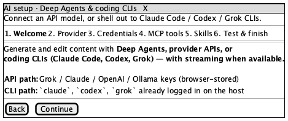
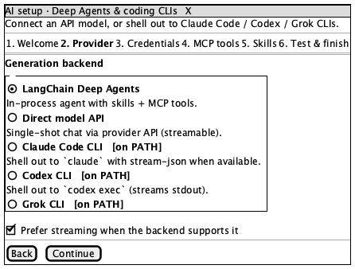
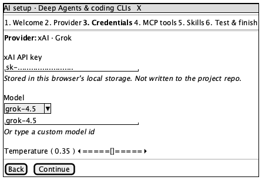
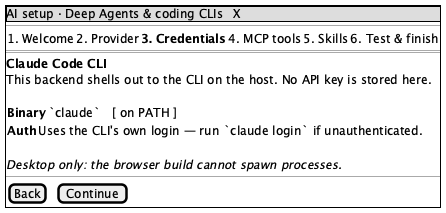
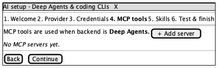
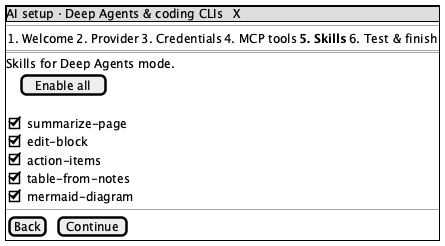
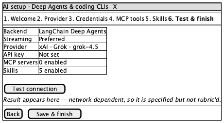

# AI Setup Wizard

**Source:** `src/components/ai/AiSetupWizard.tsx` (754 lines — the largest component in the repo)
**Reach:** `/` → sidebar **Settings** → **Configure AI**
**States:** 7 — six steps, and `credentials` branches into two genuinely different screens

## Spec

A six-step modal that configures how the app talks to an LLM: an in-process Deep
Agents runtime, a direct provider API, or a local coding CLI (`claude`, `codex`,
`grok`) shelled out to on the host.

**Layout.** A Radix `Dialog` with three fixed regions: a header (title +
description), a step-chip row, and a scrolling body. The header and chips are
shared chrome across all steps, so the rubric specifies them **once**, here, and
each step's rubric covers only its body.

| Step | `data-wizard-step` | Body |
|---|---|---|
| 1 | `welcome` | Prose: the API path vs the CLI path |
| 2 | `provider` | Radio list of five backends + a streaming toggle |
| 3 | `credentials` | **Two different screens** — see below |
| 4 | `mcp` | MCP server list, empty by default |
| 5 | `skills` | Toggle list of five skills + *Enable all* |
| 6 | `review` | Summary table + a connection test |

**The `credentials` branch.** When the selected backend is a CLI, the step renders
`CliCredentialsStep` (no API key — the CLI owns its own auth) instead of
`CredentialsStep` (key, model, temperature). These are not visual variants of one
screen; they share a step id and nothing else, which is why they get separate
wireframes.

**Navigation.** The step chips call `setStepIndex(i)` with **no gating**, so all six
steps are one click apart in any order. `canNext` gates the *Continue* button only.
That asymmetry is deliberate and is what makes this screen a good capture target.

**Entry step is not always `welcome`.** The component takes an `initialStep` prop.
Reached via Settings on a configured workspace it opens on `provider`, so a capture
recipe must select the step explicitly rather than assume the first.

**It stacks on top of Settings.** Opening the wizard does not dismiss the Settings
dialog — Settings stays mounted and visible behind the backdrop. Every capture of
this screen therefore contains a second, dimmed dialog. That is current behaviour,
not a defect, but a rubric written from the wireframe alone would flag it, so it is
recorded here and listed under *Acceptable Differences*.

## Addressability

| What | Selector |
|---|---|
| Active step | `[data-wizard-step]` — attribute value *is* the step id |
| Step chip | `[data-testid="wizard-step-<id>"]` |
| Active chip | `[aria-current="step"]` |
| Dialog | `role=dialog[name="AI setup · Deep Agents & coding CLIs"]` |
| Close | `role=button[name="Close"]` (supplied by the Radix wrapper) |

Ids: `welcome`, `provider`, `credentials`, `mcp`, `skills`, `review`.

## Capture recipe

```
1. seed localStorage["forgenotes-ui-freeze"] = "1"
   (+ localStorage["workspace-v1"] = {"state":{"theme":"dark"},"version":0} for dark)
2. load /, viewport 1280x800
3. click text "Settings"        (sidebar footer)
4. click text "Configure AI"    (inside the Settings dialog)
5. click [data-testid="wizard-step-<id>"]
6. webview_wait_for [data-wizard-step="<id>"]
7. webview_screenshot
```

Two traps, both cost real time:

- **After any `location.reload()` from injected JS, restart the driver session.**
  The reload strips the bridge's `window.__MCP__` helper, and every selector-based
  tool then fails with `resolveAll is not a function` — which reads like a broken
  bridge rather than a stale injection.
- **Scope `webview_dom_snapshot` with `--selector`.** Unscoped, it times out on this
  app's DOM. `[data-wizard-step]` is the right scope here.

## Wireframes

| State | Wireframe |
|---|---|
| 1 · Welcome |  |
| 2 · Provider |  |
| 3 · Credentials (API) |  |
| 3b · Credentials (CLI) |  |
| 4 · MCP tools |  |
| 5 · Skills |  |
| 6 · Review |  |

Sources are the matching `.puml` files. Regenerate with `npm run ui:render`.

## Rubric — shared chrome

Applies to **every** step; each step's rubric below adds only its body.

### Must Match
- [ ] Title reads "AI setup · Deep Agents & coding CLIs", with the description beneath
- [ ] Six chips, in order: Welcome, Provider, Credentials, MCP tools, Skills, Test & finish
- [ ] Exactly one chip is styled active, and it matches `[data-wizard-step]`
- [ ] A named close control is reachable
- [ ] Body scrolls independently; header and chips stay put
- [ ] Dialog is centred over a dimmed backdrop

### Acceptable Differences
- Dialog height (content-dependent), scrollbar presence, font hinting
- Chip wrapping at narrow widths
- **The Settings dialog visible behind the backdrop** — the wizard stacks on it
  rather than replacing it. The wireframes show the wizard alone, so every real
  capture will differ here. Verified current behaviour, not a defect.
- Sidebar and page content behind the backdrop, which vary with workspace state

### Must NOT Appear
- More than one active chip
- Spinners or toasts (freeze mode hides them)

### Failure Criteria
- Body content overflows the dialog instead of scrolling
- Chips clipped or unreadable
- Light surfaces while `.dark` is on the root

## Rubric — per step

### 1 · Welcome
**Must Match:** both paths named — API (browser-stored keys) and CLI (`claude`, `codex`, `grok` logged in on the host); no form controls.

### 2 · Provider
**Must Match:** five backends, in order — LangChain Deep Agents, Direct model API, Claude Code CLI, Codex CLI, Grok CLI; exactly one selected; each with its one-line description; the streaming toggle present.
**Acceptable:** the `on PATH` badge depends on what is installed, so its presence varies by machine.

### 3 · Credentials (API)
**Must Match:** provider shown; API-key field masked; the "stored in this browser's local storage" note present; model select plus custom-model input; temperature control with a visible value.
**Must NOT Appear:** a real API key in plain text.

### 3b · Credentials (CLI)
**Must Match:** names the CLI; states no key is stored; shows binary and auth rows.
**Failure:** an API-key field appearing here at all — that means the branch chose wrong.

### 4 · MCP tools
**Must Match:** the "used when backend is Deep Agents" note; an *Add server* control; the empty state reads "No MCP servers yet."

### 5 · Skills
**Must Match:** *Enable all* present; five skills — summarize-page, edit-block, action-items, table-from-notes, mermaid-diagram; each individually toggleable.

### 6 · Review
**Must Match:** summary rows for Backend, Streaming, Provider, API key, MCP servers, Skills; values agree with the earlier steps; a *Test connection* control; a final save/finish action.
**Acceptable:** every value — it reflects configuration.
**Not rubric'd:** the connection-test *result*. It is network-dependent; specified above, deliberately not asserted.

## Out of scope

`AiSetupBanner` (line 737), the MCP add/test sub-flows, and the connection-test
result. All reachable from here; none belong in this screen's rubric.
