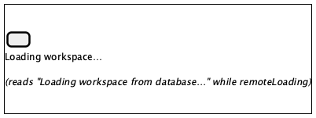
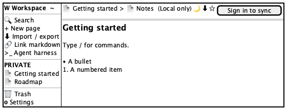
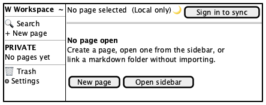
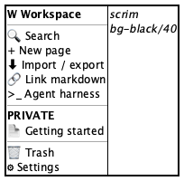
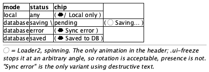
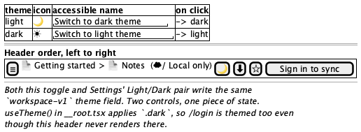

# App shell

**Source:** `src/components/layout/AppShell.tsx` (368 lines) — `AppShell`, `SyncChip`, `EmptyWorkspace`
**Reach:** `/` — the frame every other screen sits inside
**States:** 4 layout states + 4 sync-chip variants

## Spec

The whole app is two columns inside `h-dvh overflow-hidden`: a fixed-width sidebar
and a flex column holding an 44 px header (`h-11`) over a scrolling `<main>`.
**Only `<main>` scrolls** — the shell itself never does, which is why a screenshot at
1280×800 always shows the full chrome regardless of page length.

### Layout states

| State | Condition | What renders |
|---|---|---|
| Loading | `!hydrated \|\| authPending \|\| remoteLoading` | Centred pulse square + one line of text; **no sidebar, no header** |
| Page | a non-archived page matches `activePageId` | `PageEditor` |
| Mount | `mountSelection` resolves to a mount | `MountedMarkdownView` |
| Empty | neither | `EmptyWorkspace` — "No page open" + two buttons |

The loading state has **two texts** off one flag: `Loading workspace from database…`
when `remoteLoading`, otherwise `Loading workspace…`. It is the whole viewport, so it
replaces the shell rather than sitting inside it.

### Header, left to right

1. **Hamburger** (`aria-label="Open sidebar"`) — `md:hidden`, opens the mobile drawer
2. **PanelLeft** (`aria-label="Open sidebar"`) — desktop only, and **only when the
   sidebar is collapsed**. Two different buttons share that accessible name; they are
   never both visible, but a selector matching on name alone is ambiguous in the DOM.
3. **Breadcrumbs** — the full ancestor chain of the active page, each a button, `›`
   between them, last one `font-medium`. Each crumb is capped at 140 px (200 px at
   `sm`) and truncates. Replaced by a single `🔗 mount / relPath` label in mount mode,
   and by "No page selected" when neither.
4. **SyncChip** — see below
5. **Theme toggle** — a Moon in light mode, a Sun in dark. Always present, in every
   layout state that has a header.
6. **Import/export** (`title="Import / export markdown"`) — only with a page or mount
7. **Favourite star** (`aria-label="Favorite"` / `"Unfavorite"`) — page mode only;
   filled amber when set
8. **Sign in to sync** button, or `UserButton` — `hidden sm:flex`, and only when
   `authEnabled`

### Theme toggle

Its accessible name is **the destination, not the current state**:
`Switch to dark theme` while light, `Switch to light theme` while dark. A control
labelled "Dark" is ambiguous about which of the two it means, and an agent reading the
accessibility tree has only the name to go on.

The icon runs the same way — Moon while light (what you would get), Sun while dark. So
**icon and label always agree, and both disagree with the current theme.** A rubric
that expects "dark mode shows a moon" is asserting the opposite of the design.

It writes the same `setTheme` the Settings dialog does, into the same `workspace-v1`
persist. Two controls, one piece of state — flipping either updates the other, and both
survive a reload. `useTheme()` in `__root.tsx` is what actually applies `.dark` to
`<html>`, so the toggle works on `/login` too even though the header does not render
there.

### Zoom

⌘`+` / ⌘`-` / ⌘`0` are bound at the root by `useZoom()` and have **no visible control
at all** — nothing in the header changes, and there is nothing to screenshot. What they
do change is the root font size, which rescales every capture of every screen. See
[tokens.md](tokens.md); reset zoom to 1 before capturing anything.

### SyncChip

Four visual outcomes from two inputs, all `hidden sm:inline-flex` — **the chip is
absent below the `sm` breakpoint**, so a narrow capture is not missing it.

| `mode` | `status` | Icon | Label |
|---|---|---|---|
| `local` | any | `CloudOff` | Local only |
| `database` | `saving` \| `pending` | `Loader2` **spinning** | Saving… |
| `database` | `error` | `Cloud` | Sync error (destructive text) |
| `database` | `saved` | `Cloud` | Saved to DB |

The spinner is the only animation in the header — `.ui-freeze` stops it mid-rotation
at whatever angle it held, so its *rotation* is an acceptable difference but its
*presence* is not.

### Mobile drawer

Below `md`, the sidebar is replaced by a fixed overlay: a `bg-black/40` scrim plus a
`min(280px, 88vw)` panel. `Sidebar` renders with `mobile` (full width, no collapse
button) and an `onNavigate` that closes the drawer. The scrim is `aria-hidden` with a
click handler — dismissable by pointer, **not by keyboard or Escape**. That is current
behaviour and a genuine a11y gap; it is recorded here rather than rubric'd as a defect.

### Two things a rubric should not mistake for bugs

- **`EmptyWorkspace`'s "Open sidebar" button calls both `setSidebarOpen(true)` and
  `setMobileSidebar(true)`.** On desktop the drawer state flips too but the overlay is
  `md:hidden`, so nothing appears. Harmless, deliberate — one handler for both widths.
- **`AppShell.tsx:78` is the repo's one `rules-of-hooks` lint error.**
  `useLocalOnlyMode()` is a plain function whose name begins with `use`, called inside
  a nested async function. Lint is advisory in CI for exactly this reason.

## Addressability

| What | Selector |
|---|---|
| Sidebar column | `aside` — **two match below `md`**, see below |
| Header | `header` (the only one) |
| Breadcrumb | `header nav button` — ordered ancestor→self |
| Sync chip | `header span[title^="Guest mode"]` \| `[title^="Signed in"]` |
| Theme toggle | `role=button[name="Switch to dark theme"]` \| `[name="Switch to light theme"]` |
| Favourite | `role=button[name="Favorite"]` \| `[name="Unfavorite"]` |
| Import/export | `header button[title="Import / export markdown"]` |
| Open sidebar | `role=button[name="Open sidebar"]` — **two nodes, one visible** |
| Empty state | text `No page open`, `role=button[name="New page"]` |
| Mobile scrim | `.fixed.inset-0.z-50 > [aria-hidden]` |
| Toasts | `[data-sonner-toaster]` — hidden entirely by `.ui-freeze` |

The import/export button uses `title`, not `aria-label`, so its accessible name comes
from the tooltip. It **is** named in the accessibility tree, but by a different
mechanism than the star — do not assume one query shape covers both.

**Below `md` there are two `aside` elements.** The desktop sidebar's wrapper is
`hidden md:block`, so with `sidebarOpen` true the `<Sidebar>` inside it is still
*mounted* — just not displayed — while the drawer renders a second one. A bare
`aside` selector is therefore ambiguous at mobile widths, and is the wrong readiness
signal after opening the drawer. Wait on the overlay (`.fixed.inset-0.z-50`) instead.

Related: the drawer covers the hamburger that opened it, so a click-retry loop keyed on
that button will time out on an element that is merely occluded, *after* having already
succeeded.

## Capture recipe

```
1. seed localStorage["forgenotes-ui-freeze"] = "1"
   (+ localStorage["workspace-v1"] = {"state":{"theme":"dark"},"version":0} for dark)
2. load /, viewport 1280x800
3. wait for `header` to exist        ← its absence IS the loading state
4. webview_screenshot
```

| State | How |
|---|---|
| Loading | Throttle or capture the first frames — it is transient by design. Signing in makes the `remoteLoading` variant last long enough to catch. |
| Page | Default with seed data. |
| Empty | Delete every page, or clear `workspace-v1` and skip the seed. |
| Mobile drawer | Resize to 375×812, click `Open sidebar`, wait for the scrim. |
| Sync chips | `local` is the guest default. Sign in for `saved`; type to trigger `saving`; `error` needs the DB unreachable. |

**Do not capture the loading state by waiting for a selector inside it** — it has no
stable marker, only the pulse square and text. Assert `header` is *absent* instead.

## Wireframes

| State | Wireframe |
|---|---|
| 1 · Loading |  |
| 2 · Page open |  |
| 3 · Empty workspace |  |
| 4 · Mobile drawer |  |
| 5 · Sync chip variants |  |
| 6 · Header controls, light vs dark |  |

## Rubric

Tokens and always-acceptable items: [tokens.md](tokens.md).

### Must Match
- [ ] Sidebar 260 px wide, full height, right border, `--color-sidebar` surface
- [ ] Header 44 px tall with a bottom border, spanning the remaining width
- [ ] Breadcrumbs left-aligned, `›` separators, last crumb heavier than the rest
- [ ] Sync chip is a pill: rounded-full, hairline border, icon + label
- [ ] Theme toggle right of the chip, showing a **Moon in light mode, a Sun in dark**
- [ ] Star and import/export sit right of the toggle, before the account control
- [ ] Only `<main>` scrolls — header and sidebar stay put
- [ ] Empty state centres "No page open", a sub-line, then **New page** / **Open sidebar**
- [ ] Loading state is centred, has neither sidebar nor header

### Acceptable Differences
- Page titles, icons, breadcrumb depth, workspace name
- Spinner rotation angle when frozen
- Sync chip label — reflects real state
- Sidebar present or collapsed (`sidebarOpen` persists across reloads)
- Which theme is showing — but **not** the toggle's icon within a given theme
- Overall scale, if and only if zoom was left off 1 — see [tokens.md](tokens.md).
  Reset it rather than accepting it: at 1.3 every measurement in this rubric is wrong
  at once, which reads as many findings instead of one setting.

### Must NOT Appear
- A toast (`.ui-freeze` hides `[data-sonner-toaster]`)
- The sync chip below the `sm` breakpoint
- The mobile scrim at `md` and wider
- Both "Open sidebar" buttons at once
- The star or import/export button in the empty state
- A Sun in light mode, or a Moon in dark — the toggle names its destination
- Any visible zoom control (there is none; the shortcuts are keyboard-only)

### Failure Criteria
- The shell itself scrolls, or the header scrolls away
- Breadcrumbs overflow instead of truncating at 140/200 px
- Sidebar overlaps the header, or the header inset does not match the sidebar edge
- Loading state renders behind a visible shell instead of replacing it

## Out of scope

`Sidebar` ([sidebar.md](sidebar.md)), `PageEditor` ([page-editor.md](page-editor.md)),
`CommandPalette` ([command-palette.md](command-palette.md)), `MarkdownIODialog`
([dialogs.md](dialogs.md)), `MountedMarkdownView`
([mounted-markdown.md](mounted-markdown.md)). Toast content is asserted through the
DOM, never a screenshot.
