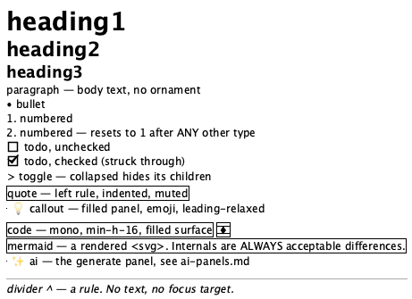
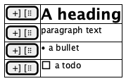
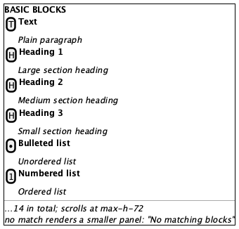
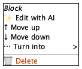

# Blocks

**Source:** `src/components/editor/BlockRow.tsx` (599), `SlashMenu.tsx` (94), `block-types.ts`, `MermaidDiagram.tsx` (97)
**Reach:** `/` → open a page → the block list
**States:** 14 block types × (rest / reveal), plus the slash menu and its empty state

## Spec

Every block is one row: `data-block-id` + `data-block-type` on the wrapper, hover
handles absolutely positioned `-left-12` outside it, and the content itself.

**One structural attribute carries the variant.** `data-block-type={block.type}` makes
all fourteen types addressable and countable through one selector, and stays correct
when a type is added — the alternative is fourteen testids, or reading type off class
names, which breaks on any restyle.

> That claim was **false for three of the fourteen** until a real capture caught it.
> `BlockRow` returns early for `divider`, `ai` and `mermaid`, roughly 130 lines above
> the wrapper that sets the attributes, and none of those three wrappers had them. The
> blocks rendered perfectly; only selector-based tooling could tell. The existing e2e
> check passed the whole time because it only inspected rows that *already* carried
> `data-block-type` — a row missing both attributes satisfied it trivially.
>
> `e2e/a11y.spec.ts` now compares the rendered row count against the store, so a fourth
> early return fails loudly. The lesson generalises: **a test that filters by the thing
> it is checking for cannot detect absence.**

### The fourteen types — one table, not fourteen sections

Rubric each row by the **Distinguishing mark** column. That mark is the entire
assertion; everything else about a block is shared chrome.

| `data-block-type` | Slash label | Distinguishing mark |
|---|---|---|
| `paragraph` | Text | Body text, no ornament. The default and the fallback. |
| `heading1` | Heading 1 | Largest text on the page after the title |
| `heading2` | Heading 2 | Between h1 and h3 — assert *ordering*, never a px value |
| `heading3` | Heading 3 | Smallest of the three, still heavier than body |
| `bullet` | Bulleted list | Leading `•`, hanging indent |
| `numbered` | Numbered list | Leading `N.` from `listNumbers` — **resets after any non-numbered block** |
| `todo` | To-do list | Checkbox, `aria-label="Mark complete"` / `"Mark incomplete"`; checked strikes the text |
| `toggle` | Toggle | Chevron, `aria-label="Expand"` / `"Collapse"`; collapsed hides children |
| `quote` | Quote | Left border rule, indented, muted |
| `callout` | Callout | Filled panel with an emoji, `text-base leading-relaxed` |
| `code` | Code | Mono, `min-h-16`, filled surface |
| `mermaid` | Mermaid | Rendered `<svg>`, with a source/preview toggle |
| `ai` | AI | The generate panel — see [ai-panels.md](ai-panels.md) |
| `divider` | Divider | A horizontal rule. **No text, no focus target.** |

Assert relative type scale, not absolute sizes: heading sizes are Tailwind utilities
and a point-release font-metric change moves every one of them together.

### Hover handles

`BlockHandles` is `[data-hover-reveal]`, `opacity-0`, made `opacity-100` when the row
is hovered **or focused**. Two controls:

- **`+`** — `aria-label="Add block below"`
- **`⠿`** — `aria-label="Block menu"`, opening: *Edit with AI* (only when `canAiEdit`),
  Move up, Move down, a **Turn into** submenu listing all 14 types, separator, and a
  destructive Delete.

`opacity-0` is not `hidden`: the handles are clickable in both states. Only a
screenshot can tell whether someone converted one into the other, which is what the
`-rest` / `-reveal` pair exists to catch.

**Focus also reveals them.** A row that has focus shows its handles in a *rest*
capture, correctly. Click the empty append area rather than a block before capturing
rest state, or the focused row will look like a reveal-mode leak.

### Slash menu

Typing `/` in a block opens a `fixed`, `w-72`, `max-h-72` popover, `role="listbox"`,
heading "Basic blocks", one `role="option"` per type with icon, label, and description.
`filterBlockTypes` matches label, description, **and** a keyword list — so `h1` finds
Heading 1 and `hr` finds Divider though neither string appears on screen. No match
renders a smaller panel reading `No matching blocks`.

Two positioning details: `left` is clamped to `window.innerWidth - 300`, so a menu
opened near the right edge shifts left; and selection uses `onMouseDown` with
`preventDefault()`, not `onClick`, to keep the editor's focus.

### Mermaid

`MermaidDiagram` renders asynchronously and its SVG contains generated ids. **Assert
that a rendered `<svg>` is present** — never its internals, and never the
loading or error state. Everything inside the SVG is an Acceptable Difference by
standing decision.

## Addressability

| What | Selector |
|---|---|
| Any block | `[data-block-id]` |
| By type | `[data-block-type="todo"]` etc. |
| Count of a type | `[data-block-type="bullet"]` length |
| Handles | `[data-hover-reveal]` inside the row |
| Add below | `role=button[name="Add block below"]` |
| Block menu | `role=button[name="Block menu"]` |
| Turn into | menu item text `Turn into` → submenu |
| Todo checkbox | `role=button[name=/Mark (complete\|incomplete)/]` |
| Toggle chevron | `role=button[name=/Expand\|Collapse/]` — **same names as the sidebar's** |
| Slash menu | `role=listbox` with heading `Basic blocks` |
| Slash option | `role=option`, selected one `aria-selected=true` |
| Slash empty | text `No matching blocks` |
| Mermaid | `[data-block-type="mermaid"] svg` |

`Expand`/`Collapse` and `Add block below` repeat per row. **Always scope to a
`[data-block-id]` first** — an unscoped query matches the sidebar tree too.

## Capture recipe

```
1. seed localStorage["forgenotes-ui-freeze"] = "1"
   (+ ["forgenotes-ui-reveal"] = "1"  for the -reveal variant)
   (+ ["workspace-v1"] = {"state":{"theme":"dark"},"version":0} for dark)
2. load /, viewport 1280x800
3. open the page holding one of each type, wait for [data-block-type="mermaid"] svg
4. click [aria-label="Add block at end"]   ← moves focus OFF any block
5. webview_screenshot
```

Step 4 matters: without it the last-focused row shows its handles and the rest capture
is wrong.

For the slash menu: focus a block, type `/`, wait for `role=listbox`. For the empty
state, type `/zzzz`.

Scope `webview_dom_snapshot` with `--selector "[data-block-id]"`. Unscoped it times
out on this app's DOM.

## Wireframes

| State | Wireframe |
|---|---|
| 1 · All 14 types (rest) |  |
| 2 · Hover handles revealed |  |
| 3 · Slash menu |  |
| 4 · Block menu |  |

One wireframe for all fourteen types, deliberately. Fourteen wireframes would be
fourteen files to re-approve on any shared-chrome change, for a distinction the table
above already carries.

## Rubric

Tokens and always-acceptable items: [tokens.md](tokens.md).

### Must Match
- [ ] Every type shows its distinguishing mark from the table
- [ ] Heading scale strictly decreases h1 > h2 > h3, and h3 > body
- [ ] Numbered runs restart at 1 after any interrupting block
- [ ] Todo checkbox left of its text; checked items struck through
- [ ] Quote carries a left rule; callout is a filled panel
- [ ] Code is monospace on a filled surface
- [ ] Mermaid shows a rendered `<svg>`, not source or a spinner
- [ ] Divider is a rule with no text
- [ ] Indent steps are uniform and capped at 4 levels
- [ ] Slash menu: heading `Basic blocks`, 14 options, exactly one `aria-selected`

### Acceptable Differences
- All block text, list lengths, todo checked/unchecked mix
- **Everything inside a Mermaid `<svg>`** — generated ids, layout, fonts
- Callout emoji
- Slash menu vertical position, and horizontal shift near the right edge
- Code block soft-wrapping

### Must NOT Appear
- `+` or `⠿` handles in a **rest** capture — the `opacity-0` → `hidden` canary
- A Mermaid loading or error placeholder
- A visible `/` left in the block after a slash selection
- Handles on a focused row in a rest capture (click the append target first)

### Failure Criteria
- Handles overlapping block text instead of sitting in the `-left-12` gutter
- Two adjacent types visually indistinguishable (h2 vs h3, quote vs callout)
- Slash menu clipped by the viewport or by the block list's overflow
- `data-block-type` absent, or not matching what is rendered
- Indent beyond 4 levels

## Out of scope

`AiBlockPanel` and `AiEditDialog` ([ai-panels.md](ai-panels.md)), the page frame
([page-editor.md](page-editor.md)), markdown conversion (unit-tested in
`src/lib/markdown/convert.test.ts`), and Mermaid's own rendering correctness.
