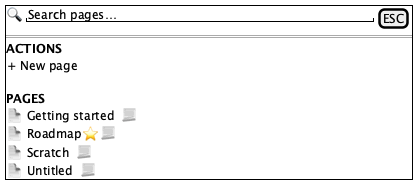
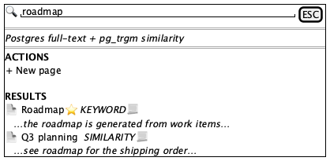
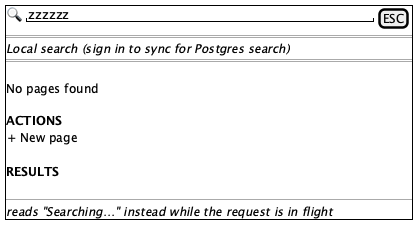

# Command palette

**Source:** `src/components/search/CommandPalette.tsx` (232 lines)
**Reach:** `⌘K` / `Ctrl+K` anywhere, or sidebar → **Search**
**States:** 4 — browse, results, searching, empty

## Spec

A `cmdk` palette in a hand-rolled overlay: a `bg-black/40` scrim plus a
`min(560px, 100%-2rem)` panel pinned at `top-18%`, `z-[100]` — above everything
including Radix dialogs.

Three stacked regions: a search row (magnifier, input, `ESC` kbd or spinner), an
optional one-line **mode banner**, and a scrolling list capped at `max-h-80`.

**The list always has an Actions group** holding a single **New page** item, above a
second group whose heading flips between **Pages** (browse, first 30 non-archived) and
**Results** (a query is present).

That "always" has a consequence worth stating, because it was a real bug: cmdk renders
`<Command.Empty>` only when the **whole list** has zero items, and the Actions group
always contributes one. So `Command.Empty` could never fire here, and a search matching
nothing showed a bare **Results** heading with no rows and no message. The empty message
is now rendered explicitly on `showHits && hits.length === 0`, and deliberately sits
*outside* both groups — a cmdk `Group` with no `Item` children hides itself, message
included.

### Search has two engines and says which one ran

The mode banner appears **only while a query is present**:

| `storageMode` | Banner |
|---|---|
| `local` | `Local search (sign in to sync for Postgres search)` |
| `database`, `trgm` true | `Postgres full-text + pg_trgm similarity` |
| `database`, `trgm` false | `Postgres full-text + ILIKE fallback` |

A failed server search falls back to local results **and relabels the banner** — so
the banner reflects what actually ran, not what was attempted. Each result row also
carries a per-hit `mode` tag (`keyword` / `similarity`) in 10 px uppercase.

**Debounce is 180 ms**, and `searching` is set *before* the timer. Between keystroke
and request the spinner replaces the `ESC` badge; they are mutually exclusive and
never both visible.

**`shouldFilter={false}`** — cmdk's built-in filtering is off, because filtering
already happened upstream (server or `localSearchPages`). Typing does not narrow the
rendered list client-side; it triggers a new search.

### Behaviours worth pinning

- **The `⌘K` handler toggles**, so pressing it with the palette open closes it.
- **Opening does not reset; closing does.** The `!open` effect clears query and hits,
  so a reopened palette is always empty — a capture never inherits a previous query.
- **`autoFocus` on the input**, and the palette returns `null` when closed. There is
  no mount-but-hidden state, so an accessibility snapshot either finds it fully or not
  at all.
- Selecting a page also dispatches `workspace:clear-mount`, which `AppShell` listens
  for — that is how opening a page from search leaves mount view.

### Why the a11y attributes are hand-written

`cmdk` brings its own dialog handling, so this is deliberately not Radix. That means
`role="dialog"`, `aria-modal`, and `aria-label` had to be written out by hand — before
that it was an anonymous `div`: invisible to accessibility tooling and unaddressable
by an agent reading the accessibility tree. Removing them does not break a single test
that clicks by text, which is exactly why it is called out here.

**No Escape handler and no focus trap.** `ESC` is *displayed* as a badge; the key is
handled by `cmdk` internally for list navigation, and dismissal is the scrim click.
Current behaviour, recorded not rubric'd.

## Addressability

| What | Selector |
|---|---|
| Palette | `[data-testid="command-palette"]` / `role=dialog[name="Command palette"]` |
| Input | `role=combobox` (cmdk's input) — placeholder varies by storage mode |
| Scrim | `.fixed.inset-0.z-\[100\] > [aria-hidden]` |
| Group headings | text `Actions`, then `Pages` \| `Results` |
| Result row | `role=option` |
| Selected row | `role=option[aria-selected=true]` — styled `bg-muted` |
| New page | `role=option` with text `New page` |
| Empty | text `No pages found` \| `Searching…` |
| Mode banner | the 11 px line directly under the input |
| Spinner | `.animate-spin` — swap for `kbd` text `ESC` when idle |

The placeholder differs by mode (`Search pages…` vs `Search pages (Postgres keyword +
similarity)…`), so do not select the input by placeholder text.

## Capture recipe

```
1. seed localStorage["forgenotes-ui-freeze"] = "1"
   (+ localStorage["workspace-v1"] = {"state":{"theme":"dark"},"version":0} for dark)
2. load /, viewport 1280x800
3. wait for `header`
4. press Meta+k            (or click sidebar "Search")
5. wait for [data-testid="command-palette"]
6. webview_screenshot
```

| State | Extra |
|---|---|
| Browse | none — the palette opens here |
| Results | type a term that matches, wait for `role=option` count > 1 **and** the banner |
| Searching | inside the 180 ms debounce — throttle, or assert `.animate-spin` rather than screenshotting |
| Empty | type a string matching nothing, wait for `No pages found` |

**Wait for the banner, not just for options.** Between keystroke and response the list
still holds the previous results, so a screenshot taken on `role=option` alone can
capture stale hits under a new query.

## Wireframes

| State | Wireframe |
|---|---|
| 1 · Browse (no query) |  |
| 2 · Results |  |
| 3 · Empty |  |

## Rubric

Tokens and always-acceptable items: [tokens.md](tokens.md).

### Must Match
- [ ] Centred horizontally, top at roughly 18% of viewport height — **not** vertically centred
- [ ] Magnifier, then input, then `ESC` badge or spinner, on one 48 px row
- [ ] A border under the search row
- [ ] Group headings 11 px, uppercase, letter-spaced, muted
- [ ] **Actions → New page** present in every state, including empty
- [ ] Second heading reads `Pages` with no query, `Results` with one
- [ ] Mode banner present with a query, absent without
- [ ] Exactly one row `aria-selected`, filled `bg-muted`
- [ ] List scrolls internally above roughly 320 px

### Acceptable Differences
- Page titles, icons, hit count, snippet text
- Which engine the banner names — it reflects real storage mode
- Per-hit `keyword` / `similarity` tags
- `ESC` badge hidden below the `sm` breakpoint

### Must NOT Appear
- Both the spinner and the `ESC` badge
- The mode banner with an empty query
- A snippet line in browse mode (`showHits` gates it)
- Results carried over from a previous query
- A **Results** heading with neither rows nor an empty message — that dead end is the
  bug the explicit empty state replaced

### Failure Criteria
- Palette below the Settings or wizard dialog — it is `z-[100]` and must win
- Scrim missing, or not dismissing on click
- Input not focused on open
- Long titles overflowing instead of truncating

## Out of scope

Ranking quality, `pg_trgm` behaviour, and the `searchPages` server function. All
better asserted through unit tests on `localSearchPages` than through a screenshot.
