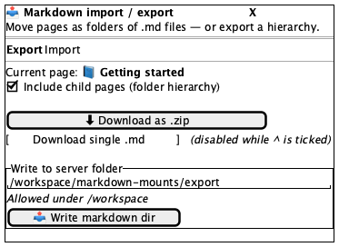
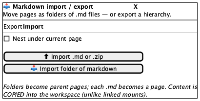
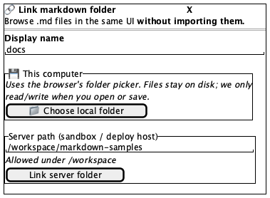
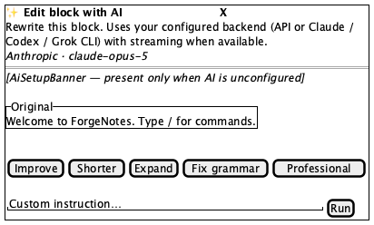
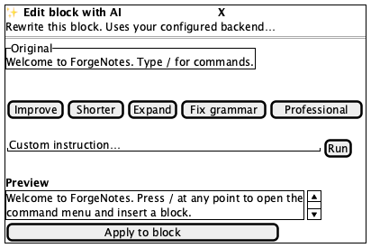

# Dialogs

**Source:** `markdown/MarkdownIODialog.tsx` (296), `markdown/LinkFolderDialog.tsx` (130), `editor/AiEditDialog.tsx` (250)
**Reach:** sidebar or header — see each section
**States:** 6 — I/O export, I/O import, Link folder, AI edit (idle / streaming / preview)

Three Radix dialogs specified together because they share all their chrome and differ
only in body. **Trash and Settings are not here** — `Sidebar` owns those, so they live
in [sidebar.md](sidebar.md).

## Shared chrome

Every dialog here is `components/ui/dialog.tsx`, which supplies the overlay, centring,
focus trap, Escape handling, and a named **Close** control. Header is a title with a
leading icon, then a description. Widths differ: `max-w-lg` for I/O and AI edit,
`max-w-md` for Link folder.

Because Radix supplies dismissal, these behave unlike `CommandPalette` (hand-rolled,
scrim-click only) and `HarnessPanel` (hand-rolled, no trap at all). Do not generalise
one dialog's behaviour to the others.

---

## 1. Markdown import / export

**Reach:** sidebar → **Import / export**, or the header's `⬇` button (page or mount open)
**Title:** "Markdown import / export"

A **segmented two-tab control** — not Radix tabs, a hand-rolled pair of buttons inside
a bordered `p-1` box. The active tab is filled `bg-foreground text-background`; the
other is muted with a hover fill. There is no `role="tablist"`, so this is a pair of
buttons to an accessibility tree, addressable only by their text.

### Export tab

Shows the current page as `icon + title`, then:

- Checkbox **Include child pages (folder hierarchy)**
- **Download as .zip** — primary, disabled while busy or with no page; shows a spinner
  in place of its download icon while busy
- **Download single .md** — outline, and **disabled whenever `hierarchy` is checked**.
  That coupling is the non-obvious bit: ticking the checkbox disables a button that
  does not mention it.
- A bordered **Write to server folder** sub-panel: a path `Input`, a hint that paths
  must live under `/workspace`, and a secondary **Write markdown dir** button

### Import tab

- Checkbox **Nest under current page**
- **Import .md or .zip** — primary; opens a hidden `<input type=file multiple>`
- **Import folder of markdown** — outline; opens a second hidden input carrying
  `webkitdirectory`
- A closing note that folders become parent pages and content is **copied**, unlike
  linked mounts

> **Both file inputs are `className="hidden"`** and triggered by `ref.current.click()`.
> Clicking either button opens a **native OS file picker**, which blocks all further
> automation exactly like a `confirm()` does. Do not click them while driving the app.

---

## 2. Link markdown folder

**Reach:** sidebar → **Link markdown**
**Title:** "Link markdown folder" — description stresses *without importing*

A **Display name** `Input`, then two bordered panels:

- **This computer** — explains that the browser folder picker is used and files stay
  on disk; **Choose local folder** button. Requires `window.showDirectoryPicker`; where
  that is absent (including WebKit) it errors rather than degrading, so this path is
  effectively Chromium-only.
- **Server path (sandbox / deploy host)** — an `Input` placeholdered
  `/workspace/markdown-samples`, a note that paths must be under `/workspace`, and a
  secondary **Link server folder** button.

**Choose local folder also opens a native picker.** Same warning as above.

The contrast with import/export is the whole point of the screen: this dialog links,
that one copies. If a rubric cannot tell the two dialogs apart from a screenshot, the
descriptions are not doing their job.

---

## 3. Edit block with AI

**Reach:** block `⠿` menu → **Edit with AI** (only when `canAiEdit`)
**Title:** "Edit block with AI"

Top to bottom: description (plus a provider line when configured), an
**`AiSetupBanner`** ([ai-panels.md](ai-panels.md)), an **Original** panel showing the
block text `line-clamp-4` (or `(empty)`), five preset buttons, a custom-instruction
row, then conditional status, error and preview regions.

**Presets, in order:** Improve · Shorter · Expand · Fix grammar · Professional.
Note **Expand** is the label for the preset whose id is `longer` — the two do not
match, so select by label.

**The Run button becomes Stop while loading** — same slot, different variant
(`destructive`), different name. They are never both present. Run is disabled until
the instruction is non-empty; Enter in the field submits.

While loading: a spinning `Loader2` plus `status ?? "Generating…"`. The preview `<pre>`
is `max-h-48`, `whitespace-pre-wrap`, and drops to `opacity-80` **while still
streaming** — so a mid-stream capture shows partial text at reduced opacity, which is
correct, not a render bug.

**Apply to block** appears only once `preview` is non-empty, full width, disabled
while loading.

> **Never rubric a streaming capture.** The preview text is nondeterministic by
> construction. Capture idle and final only; the streaming state is specified here in
> prose deliberately.
>
> `AiEditDialog` also renders its **own** `AiSetupWizard`, so the wizard can stack on
> top of this dialog — a second route to [ai-setup-wizard.md](ai-setup-wizard.md).

## Addressability

| What | Selector |
|---|---|
| I/O dialog | `role=dialog[name="Markdown import / export"]` |
| Tabs | `role=button[name="Export"\|"Import"]` — **not** tablist/tab roles |
| Hierarchy checkbox | `role=checkbox` in the export body |
| Export actions | `role=button[name="Download as .zip"\|"Download single .md"\|"Write markdown dir"]` |
| Import actions | `role=button[name="Import .md or .zip"\|"Import folder of markdown"]` |
| Link dialog | `role=dialog[name="Link markdown folder"]` |
| Display name | `role=textbox` under the label `Display name` |
| Link actions | `role=button[name="Choose local folder"\|"Link server folder"]` |
| AI dialog | `role=dialog[name="Edit block with AI"]` |
| Presets | `role=button[name="Improve"\|"Shorter"\|"Expand"\|"Fix grammar"\|"Professional"]` |
| Instruction | `role=textbox` with placeholder `Custom instruction…` |
| Run / Stop | `role=button[name="Run"]` \| `[name="Stop"]` |
| Preview | the `pre` after the text `Preview` |
| Apply | `role=button[name="Apply to block"]` |
| Close | `role=button[name="Close"]` — supplied by the Radix wrapper |

**Known gap:** the checkboxes and several `Input`s use a wrapping `<label>` rather than
`id`/`htmlFor`. `getByLabel` is unreliable through ref-forwarded components; target the
control by role within its dialog instead.

## Capture recipe

```
1. seed localStorage["forgenotes-ui-freeze"] = "1"
   (+ localStorage["workspace-v1"] = {"state":{"theme":"dark"},"version":0} for dark)
2. load /, viewport 1280x800
3. open a page (I/O export needs one; the AI dialog needs a block)
4. <per dialog, below>
5. wait for the dialog's role=dialog[name=…]
6. webview_screenshot
```

| State | Click path |
|---|---|
| I/O export | sidebar **Import / export** — opens on Export |
| I/O import | …then click **Import** |
| Link folder | sidebar **Link markdown** |
| AI idle | block `⠿` → **Edit with AI** |
| AI preview | …then a preset; wait for **Apply to block** |

**Never click** *Download as .zip*, *Import .md or .zip*, *Import folder of markdown*,
or *Choose local folder* while driving — each opens a native OS dialog that freezes
automation. Capture their rest state only.

## Wireframes

| State | Wireframe |
|---|---|
| 1 · I/O — Export |  |
| 2 · I/O — Import |  |
| 3 · Link markdown folder |  |
| 4 · Edit block with AI — idle |  |
| 5 · Edit block with AI — preview |  |

## Rubric

Tokens and always-acceptable items: [tokens.md](tokens.md).

### Must Match
- [ ] Centred over a dimmed overlay, with a named Close control
- [ ] Title carries a leading icon; description sits directly beneath
- [ ] I/O: exactly two tabs, Export first, exactly one filled
- [ ] I/O export: hierarchy checkbox above both download buttons; server panel bordered and last
- [ ] I/O import: both import buttons stacked, explanatory note last
- [ ] Link folder: Display name first, then **This computer**, then **Server path**
- [ ] AI edit: Original panel above the presets; five presets in the stated order
- [ ] AI edit: instruction field and Run/Stop share one row, Run at the right
- [ ] AI edit: Apply to block full width, and only with a preview

### Acceptable Differences
- Page title/icon in the export line; default server paths
- Preview text and provider line — both reflect real configuration
- Preset buttons wrapping to two rows at narrow widths
- The `AiSetupBanner` present or absent, depending on configuration

### Must NOT Appear
- Both Run and Stop
- A preview panel with no preview text
- **Download single .md** enabled while the hierarchy checkbox is ticked
- A native file picker or `confirm()` dialog
- The hidden `<input type=file>` elements

### Failure Criteria
- Body overflowing instead of the dialog scrolling
- Escape or Close failing to dismiss (Radix supplies both — absence is a regression)
- Preview `<pre>` growing past `max-h-48` instead of scrolling
- Import and Export tabs both filled, or neither

## Out of scope

`AiSetupBanner` and `AiBlockPanel` ([ai-panels.md](ai-panels.md)), `AiSetupWizard`
([ai-setup-wizard.md](ai-setup-wizard.md)), `HarnessPanel`
([harness.md](harness.md)), Trash and Settings ([sidebar.md](sidebar.md)). Native OS
pickers are not this app's UI and cannot be captured.
