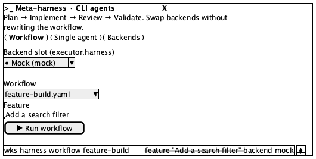
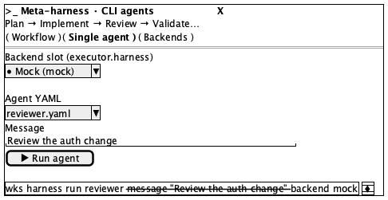
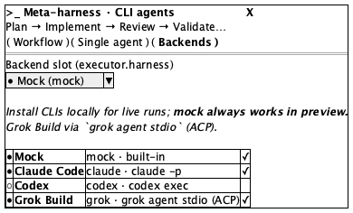
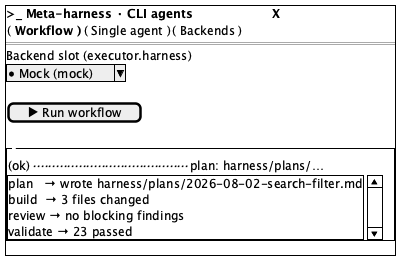

# Agent harness

**Source:** `src/components/harness/HarnessPanel.tsx` (340 lines)
**Reach:** `/` → sidebar → **Agent harness**
**States:** 5 — loading, Workflow, Single agent, Backends, plus a result panel on any tab

## Spec

A modal for driving the meta-harness CLI (`wks harness`) from the UI: pick a backend
slot, pick a workflow or agent, run it, read the result.

`max-w-2xl`, `max-h-[90vh]`, three fixed regions — a header (title, description, tab
pills), a scrolling body, and no footer. **`z-[120]`, the highest surface in the app**;
`CommandPalette` is `z-[100]`, so the harness wins if both are somehow open.

**Backend slot is above the tabs' content and shared by all of them.** Its options are
prefixed `●` (available) or `○` (not) — a text glyph, not an icon, so it survives an
accessibility snapshot as literal text.

### Tabs — pills, not a tablist

Three rounded-full pills: **Workflow**, **Single agent**, **Backends**. Active is
`bg-foreground text-background`; inactive is `bg-muted`. They are plain buttons with no
`role="tab"`, so target them by text.

| Tab | Body |
|---|---|
| Workflow | Workflow `<select>`, Feature `Input`, **Run workflow**, and a `<pre>` showing the exact CLI the run maps to |
| Single agent | Agent YAML `<select>`, Message `Input`, **Run agent**, plus its CLI `<pre>` |
| Backends | A prose note about mock always working, then one card per backend: a status dot (`emerald-500` when available, else muted), label, `id · command`, notes, and a check on the right |

The CLI `<pre>` blocks are **live** — they interpolate the current selections, so they
change as the form changes. That is the point: the panel teaches the command it is
running. Their text is an Acceptable Difference; their *presence* is not.

### Result panel

Renders under whichever tab is open once a run completes. `data-testid="harness-result"`,
holding an `ok` / `failed` pill, a `[data-volatile]` line, an optional plan path, and a
`max-h-48` scrolling summary `<pre>`.

**`{runId} · {backend} · {durationMs}ms` is `[data-volatile]`** — every value differs
per run, so `.ui-freeze` hides it with `visibility: hidden`. The line keeps its height:
the gap in a frozen capture is the hidden metadata, not a layout bug.

`emerald` appears here too (dot and check) and, like the sidebar's sync icon, is not a
theme token.

### Two real a11y gaps, recorded not rubric'd

This modal is **hand-rolled, not `components/ui/dialog.tsx`**. It has `role="dialog"`,
`aria-modal`, and `aria-labelledby`, so it is addressable — but it has **no focus trap,
no Escape handler, and no focus restore**. The scrim is a real `<button>` labelled
`Dismiss` (better than `AppShell`'s `aria-hidden` scrim), and it refuses to close while
a run is in flight. The `X` is labelled `Close` and closes **unconditionally**, even
mid-run — the two dismissal paths disagree, deliberately or not, and that is current
behaviour.

Moving this onto the shared Radix wrapper is tracked separately; when it lands, this
section and the rubric below both change.

### Success is a toast, not a panel change

Both runs call `toast.success(...)` on completion. `.ui-freeze` hides
`[data-sonner-toaster]` entirely, so **a frozen capture never shows the success
toast** — assert it through the DOM instead. The result panel is the screenshot-visible
evidence a run finished.

## Addressability

| What | Selector |
|---|---|
| Panel | `role=dialog[name="Meta-harness · CLI agents"]` |
| Scrim | `role=button[name="Dismiss"]` |
| Close | `role=button[name="Close"]` |
| Tabs | `role=button[name="Workflow"\|"Single agent"\|"Backends"]` |
| Backend slot | `role=combobox` — the first `select`, label `Backend slot (executor.harness)` |
| Workflow / Agent select | the second `select` on those tabs |
| Feature / Message | `role=textbox` — the only one on its tab |
| Run | `role=button[name="Run workflow"\|"Run agent"]` |
| CLI preview | the `pre` after the Run button |
| Result | `[data-testid="harness-result"]` |
| Status pill | text `ok` \| `failed` inside the result |
| Volatile line | `[data-volatile]` |
| Backend card | `.rounded-lg.border` rows on the Backends tab |

Selects use wrapping `<label>` with no `htmlFor`, so `getByLabel` is unreliable —
address them positionally within the panel. This is the repo's densest cluster of that
gap: **three** selects in one modal.

## Capture recipe

```
1. seed localStorage["forgenotes-ui-freeze"] = "1"
   (+ localStorage["workspace-v1"] = {"state":{"theme":"dark"},"version":0} for dark)
2. load /, viewport 1280x800
3. click sidebar "Agent harness"
4. wait for role=dialog[name="Meta-harness · CLI agents"]
5. wait for role=button[name="Run workflow"]   ← its absence IS the loading state
6. webview_screenshot
```

| State | Extra |
|---|---|
| Loading | transient — assert `Loading harness…` rather than screenshotting |
| Workflow | default tab |
| Single agent | click **Single agent** |
| Backends | click **Backends** |
| Result | select the `mock` backend and Run — mock always works, no CLI needed |

**Use the `mock` backend for the result capture.** A real CLI backend is slow,
nondeterministic, and may not be installed; mock always works in preview and produces
the same panel structure.

Freeze mode matters more here than anywhere else in the app: without it the capture
carries a run id, a duration in milliseconds, a spinner, and a toast — four sources of
noise in one screenshot.

## Wireframes

| State | Wireframe |
|---|---|
| 1 · Workflow tab |  |
| 2 · Single agent tab |  |
| 3 · Backends tab |  |
| 4 · Result panel |  |

## Rubric

Tokens and always-acceptable items: [tokens.md](tokens.md).

### Must Match
- [ ] Title "Meta-harness · CLI agents" with a terminal icon, description beneath
- [ ] Three pills in order: Workflow, Single agent, Backends — exactly one filled
- [ ] Backend slot select above the tab body, on **every** tab
- [ ] Backend options prefixed `●` or `○`
- [ ] Workflow tab: Workflow select, Feature field, Run workflow, CLI `<pre>` — in that order
- [ ] Single agent tab: Agent YAML select, Message field, Run agent, CLI `<pre>`
- [ ] Backends tab: one bordered card per backend, status dot at the left
- [ ] CLI `<pre>` is monospace on a muted fill and reflects current selections
- [ ] Result: status pill first, then metadata, then a scrolling summary
- [ ] Only the body scrolls; header and pills stay put

### Acceptable Differences
- Which backends are available — depends on what is installed
- Workflow and agent lists, default feature/message text
- Exact CLI text in the `<pre>` — it interpolates the form
- Result summary text; `ok` vs `failed`
- Panel height (content-dependent, capped at 90vh)

### Must NOT Appear
- A visible run id or duration under `.ui-freeze` — `[data-volatile]` must be hidden
- A spinner in a frozen capture
- A success toast (hidden by `.ui-freeze`)
- A result panel before any run
- More than one filled pill

### Failure Criteria
- Panel below the command palette — this is `z-[120]` and must win
- Body overflowing the 90vh cap instead of scrolling
- Summary `<pre>` growing past `max-h-48`
- The volatile line collapsing the layout when hidden (it is `visibility`, not `display`)
- Scrim dismissing the panel mid-run — it refuses while `running`

## Out of scope

The harness CLI itself (`harness/README.md`), workflow YAML semantics, backend
availability detection, and toast content. `wks harness` behaviour is a CLI concern,
not a screen.
