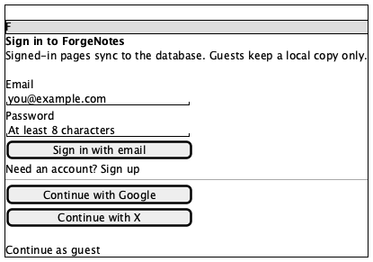
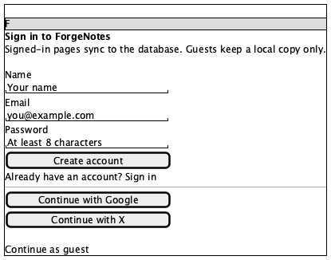
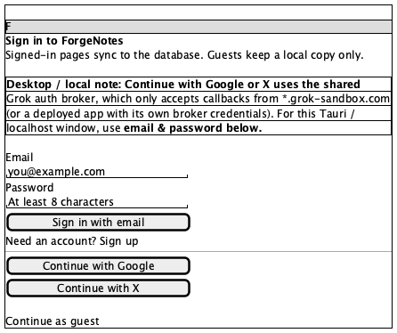
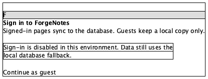

# Login

**Source:** `src/routes/login.tsx` (215 lines)
**Reach:** `/login` — the **only** screen besides `/` with a real URL
**States:** 4 — sign-in, sign-up, loopback note, auth-disabled. Errors overlay any of them.

## Spec

A single centred card, `max-w-sm`, on a full-height `bg-background` canvas. Three
stacked regions with no chrome around them: brand block, credential form, guest
escape hatch.

**Two authentication paths, and only one of them works locally.** Email + password
posts to this app's own Better Auth. *Continue with Google* / *Continue with X*
federate through a shared Grok broker whose preview OAuth client only accepts
`*.grok-sandbox.com` callbacks — so on `localhost`, `127.0.0.1`, or inside the Tauri
window the social buttons **cannot** succeed. They are still rendered, deliberately:
hiding them would make the desktop build look like a different product. The loopback
note above the form is what explains the dead end.

**Modes.** `mode` toggles between `signin` and `signup`. Sign-up adds a **Name**
field at the top of the form and relabels the submit button; nothing else moves. The
toggle is the small underlined text button directly beneath submit.

**Redirect-away.** `useCurrentUserState()` returns `{ user, isPending }`, and the
route renders `<Navigate to="/" />` when `!isPending && user`. The `isPending` guard
is load-bearing: `user === null` means *loading or signed out*, so redirecting on
`null` alone bounces signed-in users on every hard reload. A capture that lands on
`/` instead of the login form means a session cookie survived — clear it, do not
"fix" the guard.

**Auth disabled.** When `VITE_AUTH_ENABLED === "false"` the whole form is replaced by
one muted paragraph. Local data still works through the PGlite fallback.

**Busy.** Every control takes `disabled={busy}` during submit and the button reads
`Working…`. There is no spinner anywhere on this screen, which is why it needs no
freeze handling beyond the caret.

### Two fixed bugs worth remembering

Both shipped green in PR #1 and were found by capturing this screen, not by reading it.

1. **Dark mode was unreachable.** The effect applying `.dark` to `<html>` lived
   inside `AppShell`, which `/login` never renders. Now hoisted to `useTheme()` in
   `src/routes/__root.tsx`. A light login page under a dark theme is a regression of
   exactly that fix.
2. **Hydration mismatch.** `isLocalAuthOrigin()` reads `window.location`, so it was
   `false` during SSR and `true` on the client while the loopback note rendered
   straight off it. It is now `useState(false)` plus a mount effect (lines 31–32) —
   which means **the note is absent in the server-rendered markup and appears one
   frame later.** Wait for it; do not screenshot the first paint.

## Addressability

Best-labelled screen in the repo — all three inputs carry `id` + `htmlFor`, so
`getByLabel` works and no testids are needed.

| What | Selector |
|---|---|
| Email | `role=textbox[name="Email"]` / `#email` |
| Password | `#password` (type=password — not an ARIA textbox) |
| Name (sign-up only) | `role=textbox[name="Name"]` / `#name` |
| Submit | `role=button[name="Sign in with email"]` \| `[name="Create account"]` \| `[name="Working…"]` |
| Mode toggle | `role=button[name=/Need an account|Already have an account/]` |
| Social | `role=button[name="Continue with Google"]`, `[name="Continue with X"]` |
| Guest escape | `role=link[name="Continue as guest"]` → `/` |
| Error | `.text-destructive` paragraph, last child before the guest link |

The submit button's accessible name **changes with state** (`Sign in with email` →
`Working…` → back). Match on a stable anchor — `form button[type=submit]` — when
asserting across a submit.

## Capture recipe

The only screen that needs no click path to reach.

```
1. seed localStorage["forgenotes-ui-freeze"] = "1"
   (+ localStorage["workspace-v1"] = {"state":{"theme":"dark"},"version":0} for dark)
2. load /login, viewport 1280x800
3. wait for role=button[name="Sign in with email"]   ← not just DOMContentLoaded
4. webview_screenshot
```

Per state:

| State | Extra step |
|---|---|
| Sign-in | none — this is the default |
| Sign-up | click the mode toggle, wait for `#name` |
| Loopback note | open on `127.0.0.1` or `localhost`, **wait for the amber note** — it mounts one frame after hydration |
| Auth disabled | run the dev server with `VITE_AUTH_ENABLED=false` |
| Error | submit an unregistered email with any 8-char password |

Do **not** capture on a `*.grok-sandbox.com` origin when you want the loopback note:
that is the one origin where it is correctly absent.

## Wireframes

| State | Wireframe |
|---|---|
| 1 · Sign in |  |
| 2 · Sign up |  |
| 3 · Loopback note |  |
| 4 · Auth disabled |  |

## Rubric

Tokens and the always-acceptable list live in [tokens.md](tokens.md).

### Must Match
- [ ] Square `F` mark, centred, above the heading
- [ ] Heading reads "Sign in to ForgeNotes"
- [ ] Sub-line: pages sync when signed in, guests keep a local copy
- [ ] Email and Password fields, in that order, each with a visible label above it
- [ ] Full-width primary submit button directly under the form
- [ ] Mode-toggle text button beneath submit
- [ ] An `or` divider, then **two** outline buttons — Google, then X
- [ ] "Continue as guest" link at the bottom
- [ ] Whole card centred both axes, roughly 384 px wide

### Acceptable Differences
- Card vertical position at viewport heights other than 800 px
- Password dots rendering
- Native autofill styling on a browser with saved credentials
- The order of *sign-in* vs *sign-up* text on the toggle — it reflects `mode`

### Must NOT Appear
- A spinner (there isn't one — `busy` only relabels the button)
- A visible password value
- The loopback note on a public origin, or its absence on `127.0.0.1` after hydration
- Social buttons in the auth-disabled state

### Failure Criteria
- Light card surfaces while `.dark` is on `<html>` — this is the regression the
  `__root.tsx` theme fix exists to prevent
- Name field present in sign-in mode, or absent in sign-up mode
- Error text rendered anywhere but the destructive-bordered box
- Any control still enabled while the button reads `Working…`

## Out of scope

The OAuth popup itself (`/auth/popup`, served by `authPopupPlugin` in
`vite.config.ts` — **not** a React route, and must never become one), and the
post-sign-in redirect target.
