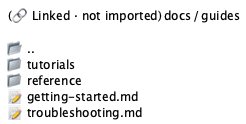
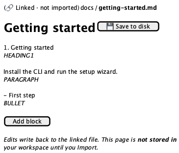
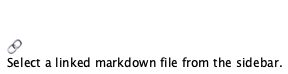

# Mounted markdown

**Source:** `src/components/markdown/MountedMarkdownView.tsx` (314 lines)
**Reach:** `/` → sidebar **Linked markdown** → expand a mount → click a folder or `.md`
**States:** 4 — no selection, loading, browse (directory), file (editor)

## Spec

The view for a **linked** folder: `.md` files edited in place on disk, never copied
into the workspace. It replaces `PageEditor` in `AppShell`'s `<main>` whenever
`mountSelection` resolves, and it shares that component's column geometry —
`max-w-3xl`, `px-4 sm:px-12`, `pb-32`.

### Header strip — the same in both modes

A **`🔗 Linked · not imported` pill** (rounded-full, bordered, muted fill), then the
mount name as a button, then one `/`-separated crumb per path segment. Every crumb is
clickable except the last in file mode, which is plain text. Clicking a crumb ending
`.md` loads the file; anything else loads the directory.

The pill is the screen's whole thesis. It is the only on-screen thing distinguishing a
linked file from a workspace page, and both render in the same frame with the same
column width — so **a rubric that loses the pill cannot tell the two screens apart.**

### No selection

`Link2` icon at 40% opacity over "Select a linked markdown file from the sidebar."
Reached by clearing the selection while still in mount mode; not a common state.

### Browse mode

A flat list of directory entries. When `dirPath` is non-empty a `..` row with a folder
icon leads up one level. Entries load lazily, and a failure resolves to an empty list
rather than an error row.

### File mode — an editor, but not *the* editor

Deliberately simpler than `PageEditor`, and the differences matter:

| | Page editor | Mounted markdown |
|---|---|---|
| Title | `textarea`, auto-growing | `input`, single-line |
| Save | continuous, to the store | explicit **Save to disk** button |
| Block UI | hover handles, slash menu, 14 types | none |
| Block type | styled per type | shown as a 10 px uppercase caption **below** each block |
| Add block | invisible append target | a visible **Add block** ghost button |

Each block is a bare `textarea` with a **transparent border** that becomes visible on
hover or focus — so at rest the blocks look like plain text, and the editing affordance
only appears on interaction. Its `rows` is computed from the newline count, so it grows
with content. `placeholder={block.type}` means an empty block shows its type name as
placeholder text.

**`Save to disk` is disabled until `dirty`**, and `dirty` is set by any edit to the
title or any block. A closing note repeats that edits write back to the file and the
page is not in the workspace until imported.

### A wrinkle worth knowing

The file ends with `void BlockRow;` — a real import kept alive to silence an unused
warning. `BlockRow` is **not** used here; the block rendering above is hand-rolled.
Do not expect `data-block-id` or `data-block-type` on this screen. They are absent, and
that absence is correct.

## Addressability

| What | Selector |
|---|---|
| Linked pill | text `Linked · not imported` |
| Mount crumb | first button in the header strip |
| Path crumb | subsequent buttons; the last in file mode is a plain `span` |
| Up one level | `role=button[name=".."]` |
| Directory entry | rows in the browse list |
| Title | the `input` at `text-3xl` — **not** a textbox with a placeholder |
| Save | `role=button[name="Save to disk"]` |
| Block | `role=textbox` with placeholder equal to its block type |
| Type caption | the 10 px uppercase text under each block |
| Add block | `role=button[name="Add block"]` |
| Loading | text `Loading…` |
| Error | `.text-destructive` box under the header |
| Empty | text `Select a linked markdown file from the sidebar.` |

**No `data-block-*` attributes here.** Blocks are addressable only by their
`placeholder` (their type) and their caption — which means two paragraphs are
indistinguishable except by index. That is a genuine gap, recorded rather than
rubric'd.

## Capture recipe

```
1. seed localStorage["forgenotes-ui-freeze"] = "1"
   (+ localStorage["workspace-v1"] = {"state":{"theme":"dark"},"version":0} for dark)
2. load /, viewport 1280x800
3. sidebar -> Linked markdown -> expand a mount    (children load lazily on first expand)
4. click a folder (browse) or a .md file (file)
5. wait for text "Linked · not imported"
6. webview_screenshot
```

Needs a mount to exist first. The server path
`/workspace/markdown-samples` is the documented sample; **Link markdown → Link server
folder** creates it without a native picker, which is why the server path is the only
mount route usable while driving the app. *Choose local folder* opens an OS dialog and
freezes automation — see [dialogs.md](dialogs.md).

## Wireframes

| State | Wireframe |
|---|---|
| 1 · Browse (directory) |  |
| 2 · File (editor) |  |
| 3 · No selection |  |

## Rubric

Tokens and always-acceptable items: [tokens.md](tokens.md).

### Must Match
- [ ] `🔗 Linked · not imported` pill present in **both** browse and file mode
- [ ] Crumbs after the pill, `/`-separated, mount name first
- [ ] Last crumb in file mode is plain text, not a button
- [ ] Browse: one row per entry; `..` present only below the mount root
- [ ] File: single-line title at `text-3xl font-bold`, Save button on the same row
- [ ] Save disabled until an edit has been made
- [ ] Each block shows its type as a small uppercase caption **beneath** it
- [ ] Visible **Add block** button after the last block
- [ ] Closing note that edits write back and nothing is stored until Import
- [ ] Column geometry matches the page editor — same width, same padding

### Acceptable Differences
- Mount name, path depth, file names, file content
- Block `textarea` heights (computed from line count)
- Number of entries in browse mode

### Must NOT Appear
- Block hover handles, the slash menu, or a block `⠿` menu — none exist here
- `data-block-id` or `data-block-type` attributes
- The linked pill on a workspace page, or its absence here
- A visible block border at rest (transparent until hover or focus)

### Failure Criteria
- The linked pill missing — the screen becomes indistinguishable from the page editor
- Save enabled with no changes, or still disabled after an edit
- Crumbs overflowing instead of wrapping
- Block captions above their blocks rather than below

## Out of scope

`LinkFolderDialog` ([dialogs.md](dialogs.md)), the sidebar's mount tree
([sidebar.md](sidebar.md)), markdown parsing (`src/lib/markdown/convert.ts`, unit
tested), and filesystem behaviour.
