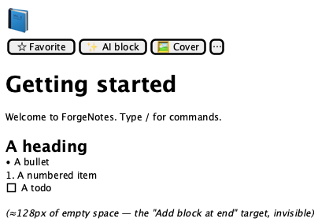
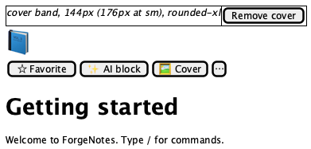
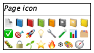
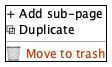

# Page editor

**Source:** `src/components/editor/PageEditor.tsx` (354 lines)
**Reach:** `/` → select any page in the sidebar
**States:** 4 — default, with cover, icon picker, page-actions menu

## Spec

The page frame: everything above the block list, plus the list container itself. The
blocks are specified separately in [blocks.md](blocks.md).

A `max-w-3xl` centred column, `px-4 sm:px-12`, with `pb-32` of trailing space so the
last block is never flush against the viewport bottom.

Four regions, top to bottom:

1. **Cover** — only when `page.cover` is set. A 144 px band (176 px at `sm`), bled
   `-mx-4` wider than the column, carrying a hover-revealed **Remove cover** button in
   its bottom-right.
2. **Icon + action row** — a 64 px emoji button opening a popover grid, then Favorite,
   AI block, Cover, and a `⋯` **Page actions** menu.
3. **Title** — a `textarea`, not an input. It is `rows={1}` and auto-grows via a
   `scrollHeight` effect on every title change, so a long title wraps and pushes the
   body down rather than scrolling internally. Placeholder `Untitled`. **Enter moves
   focus to the first block** instead of inserting a newline.
4. **Block list** — `pl-10 sm:pl-12`, leaving a gutter for the hover handles, which
   are positioned `-left-12` **outside** each row.

Below the list is a **click-to-append target**: a 64 px-tall invisible button
(`aria-label="Add block at end"`) spanning the column. It is the large empty area under
the last block; clicking it focuses the trailing empty paragraph if one exists, and
otherwise creates one. It has no visible styling at all — a rubric will not see it, and
should not expect to.

### Menus

**Cover** — one item per `COVER_PRESETS` entry, each with a colour swatch, plus a
**Remove cover** item that appears only when a cover is set.

**Page actions** (`⋯`) — Add sub-page, Duplicate, separator, then a destructive
**Move to trash**. Note the wording: the sidebar's row menu says *Delete* for the same
archive operation. Both are correct; they disagree, and that is current behaviour.

**Icon picker** — a `w-72` popover, heading "Page icon", `PAGE_ICONS` in an 8-column
grid; the current icon is `bg-muted` with a `ring-1`.

### Numbering is positional, and resets

`listNumbers` walks the block array and increments only across a **consecutive** run of
`numbered` blocks — any other type in between resets the counter to zero. So two
numbered lists separated by a paragraph both start at 1. That is intended; a rubric
seeing "1,2,3 … 1,2" is looking at correct behaviour.

### Two overlapping Favorite controls

The header star ([app-shell.md](app-shell.md)) and this row's labelled
**Favorite** / **Unfavorite** button toggle the same field. Both are visible at once
with a page open, and both change label/fill together.

## Addressability

| What | Selector |
|---|---|
| Title | `role=textbox` with placeholder `Untitled` — a `textarea` |
| Icon button | `role=button[name="Change page icon"]` |
| Icon grid | popover, heading text `Page icon` |
| Favorite | `role=button[name=/^(Favorite\|Unfavorite)$/]` — **also matches the header star** |
| AI block | `role=button[name="AI block"]` |
| Cover | `role=button[name="Cover"]` |
| Page actions | `role=button[name="Page actions"]` |
| Remove cover | `role=button[name="Remove cover"]` — **two of them**: the hover button and the menu item |
| Block list | the `div` holding `[data-block-id]` children |
| Append target | `role=button[name="Add block at end"]` |
| Cover hover button | `[data-hover-reveal]` inside `.group\/cover` |

Two names are ambiguous by construction — `Favorite` (header + action row) and
`Remove cover` (hover overlay + menu item). Scope to `main` or to the open menu.

## Capture recipe

```
1. seed localStorage["forgenotes-ui-freeze"] = "1"
   (+ ["forgenotes-ui-reveal"] = "1"  to force the cover button visible)
   (+ ["workspace-v1"] = {"state":{"theme":"dark"},"version":0} for dark)
2. load /, viewport 1280x800
3. click a sidebar page, wait for [data-block-id]
4. webview_screenshot
```

| State | Extra |
|---|---|
| Default | a page with no cover |
| With cover | Cover → pick a preset; add `forgenotes-ui-reveal` for the Remove button |
| Icon picker | click the emoji, wait for text `Page icon` |
| Page actions | click `⋯`, wait for `Move to trash` |

The title `textarea` shows a caret. `.ui-freeze` blanks it (`caret-color: transparent`),
which is why the freeze flag matters here even with no animation on screen.

## Wireframes

| State | Wireframe |
|---|---|
| 1 · Default |  |
| 2 · With cover |  |
| 3 · Icon picker |  |
| 4 · Page actions |  |

## Rubric

Tokens and always-acceptable items: [tokens.md](tokens.md).

### Must Match
- [ ] Column centred, capped near 768 px, generous left padding at `sm` and up
- [ ] Icon button 64 px, emoji rendered large, left of the action row
- [ ] Action row order: Favorite, AI block, Cover, `⋯` — all ghost, all muted
- [ ] Title at `text-4xl font-bold`, no visible border or background
- [ ] Blocks indented `pl-10`/`pl-12`, leaving a clear left gutter
- [ ] Cover, when present, bleeds wider than the text column and is rounded
- [ ] Roughly 128 px of empty space below the last block
- [ ] Numbered runs restart at 1 after any interrupting block

### Acceptable Differences
- Title text, icon, cover preset colour, block content and count
- Title wrapping to 2+ lines — the textarea auto-grows
- Favorite label — reflects state

### Must NOT Appear
- The cover **Remove cover** button in a rest capture (`opacity-0`)
- Block hover handles in a rest capture (see [blocks.md](blocks.md))
- A scrollbar inside the title
- A visible border on the append target

### Failure Criteria
- Title scrolls internally instead of growing
- Block handles overlapping text instead of sitting in the gutter
- Cover clipping the icon or the action row
- Icon-picker popover rendering off-screen

## Out of scope

Individual block rendering and the slash menu ([blocks.md](blocks.md)), `AiBlockPanel`
and `AiEditDialog` ([ai-panels.md](ai-panels.md)), and cover-preset colour values,
which belong to `src/lib/seed.ts`.
