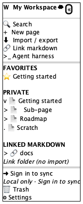
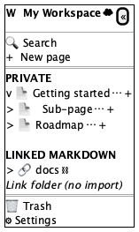
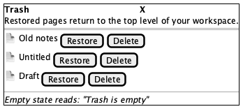
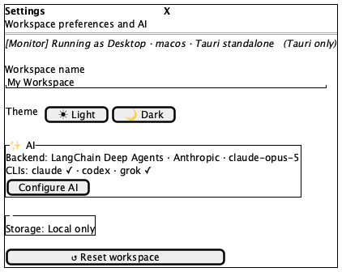

# Sidebar

**Source:** `src/components/layout/Sidebar.tsx` (675 lines) — `Sidebar`, `SidebarAction`
**Reach:** `/` — always present at `md` and wider when `sidebarOpen`; the mobile drawer at narrower widths
**States:** 5 — default, hover-revealed, empty, Trash dialog, Settings dialog

## Spec

A 260 px `<aside>` on the `--color-sidebar` surface, five stacked regions, only the
middle one scrolling:

1. **Workspace button** — initial-letter square + workspace name + a sync icon. The
   whole row opens **Settings**. Beside it (desktop only) a collapse button.
2. **Desktop badge** — `Monitor` icon + `Desktop · <platform>`, only under Tauri.
   Absent in the browser, which is why a web capture is not missing it.
3. **Five actions** — Search, New page, Import / export, Link markdown, Agent harness.
4. **Scrolling tree** — Favorites (only when non-empty), Private, Linked markdown.
5. **Footer** — sign-in link *or* `UserButton`, then Trash and Settings.

### The page tree

Recursive, one row per page, indented `8 + depth × 12` px. Each row has three parts:

- a **chevron** (`aria-label="Collapse"` / `"Expand"`) — an empty 14 px spacer when the
  page has no children, so rows stay aligned
- a **title button** — emoji icon (default `📄`) + title (default `Untitled`)
- a **hover group** (`data-hover-reveal`, `opacity-0 group-hover:opacity-100`) holding
  the `⋯` **Page menu** and a **New sub-page** `+`

**Default expansion is depth-based, not stored:** `expanded[id] ?? depth < 1`. Roots
open, everything deeper closed, and the state resets on reload. A capture of a deep
tree must click each level open.

The `⋯` menu has four items: Favorite/Unfavorite, Add sub-page, Duplicate, then a
separator and a destructive Delete. Delete archives — it does not destroy; Trash is
where permanent deletion lives.

### Linked markdown

Mounts load their children **lazily** — `loadMountKids` fires on first expand, so the
list is empty until then, and a failure resolves to an empty array rather than an
error state. Children show `📁` or `📝`. The unlink button is `data-hover-reveal` with
`title="Unlink"` and no confirmation.

A static line, "Link folder (no import)", always sits below the mount list. It is
explanatory text, not a button — a rubric that reads it as an affordance is wrong.

### Sync icon (workspace row) — four variants, and *not* the same as the header chip

| `storageMode` | `syncStatus` | Icon | Colour |
|---|---|---|---|
| `local` | any | `CloudOff` | muted |
| `database` | `saving` \| `pending` | `Cloud` **pulsing** | muted |
| `database` | `error` | `CloudOff` | destructive |
| `database` | `saved` | `Cloud` | `emerald-600` |

The header's `SyncChip` ([app-shell.md](app-shell.md)) is a labelled pill; this is a
bare icon, and the two disagree on iconography — `saving` is a pulsing `Cloud` here and
a spinning `Loader2` there. Both are current behaviour. `emerald-600` is the one colour
in the app that is **not** a theme token.

### Two dialogs live here

**Trash** (`max-w-md`) — archived pages, each with Restore and a destructive Delete.
Empty state: "Trash is empty".

**Settings** (`max-w-md`) — desktop badge if applicable, workspace-name input, a
Light/Dark segmented pair, an AI card (backend · provider · model, a CLI availability
line, and the **Configure AI** button that opens the wizard on its `provider` step), a
storage line, and a destructive **Reset workspace**.

> **Trap: Reset workspace calls native `confirm()`** (line 653). A browser modal blocks
> every subsequent automation event — the MCP bridge stops responding and looks broken
> rather than blocked. **Do not click it while driving the app.** If you do, dismiss it
> by hand in the window.

### Addressability gap, recorded honestly

The chevron on a **mount** row has no `aria-label` (page rows have one). Target it
structurally, and do not read its absence from an accessibility snapshot as the row
being missing.

## Addressability

| What | Selector |
|---|---|
| Root | `aside` |
| Workspace / Settings | first `aside button` — its name is the workspace name |
| Collapse | `role=button[name="Collapse sidebar"]` |
| Actions | `role=button[name="Search"\|"New page"\|"Import / export"\|"Link markdown"\|"Agent harness"]` |
| Section heads | text `Favorites`, `Private`, `Linked markdown` |
| Page row | the `.group` div; title button is its second child |
| Expander | `role=button[name="Expand"\|"Collapse"]` |
| Page menu | `role=button[name="Page menu"]` |
| New sub-page | `role=button[name="New sub-page"]` |
| Hover group | `[data-hover-reveal]` |
| Unlink | `button[title="Unlink"]` |
| Trash / Settings | `role=button[name="Trash"\|"Settings"]` |
| Settings dialog | `role=dialog[name="Settings"]` |
| Trash dialog | `role=dialog[name="Trash"]` |
| Configure AI | `role=button[name="Configure AI"]` |

`Expand`/`Collapse` and `Page menu` repeat once per row — always scope to a row first.

## Capture recipe

```
1. seed localStorage["forgenotes-ui-freeze"] = "1"
   (+ ["forgenotes-ui-reveal"] = "1"  for the -reveal variant)
   (+ ["workspace-v1"] = {"state":{"theme":"dark"},"version":0} for dark)
2. load /, viewport 1280x800
3. wait for `aside`
4. webview_screenshot --selector aside
```

| State | Extra |
|---|---|
| Default | none |
| Reveal | seed `forgenotes-ui-reveal` — a real `:hover` reveals **one** row; the flag reveals all |
| Empty | clear `workspace-v1` and skip seeding, or delete every page |
| Trash | click `Trash`, wait for `role=dialog[name="Trash"]` |
| Settings | click `Settings`, wait for `role=dialog[name="Settings"]` |

Scope the snapshot to `aside`. An unscoped `webview_dom_snapshot` times out on this
app's DOM.

## Wireframes

| State | Wireframe |
|---|---|
| 1 · Default (rest) |  |
| 2 · Hover affordances revealed |  |
| 3 · Trash dialog |  |
| 4 · Settings dialog |  |

## Rubric

Tokens and always-acceptable items: [tokens.md](tokens.md).

### Must Match
- [ ] Workspace row on top: letter square, name, sync icon — collapse button at the right
- [ ] Five actions in order: Search, New page, Import / export, Link markdown, Agent harness
- [ ] Section headings uppercase, 11 px, letter-spaced, muted
- [ ] Private always present; Favorites only when a page is favourited
- [ ] Child rows indented 12 px per level, chevrons aligned in one column
- [ ] Active row filled with `--color-sidebar-active`
- [ ] "Link folder (no import)" below the mount list
- [ ] Footer separated by a top border, holding Trash then Settings
- [ ] Only the middle region scrolls

### Acceptable Differences
- Workspace name, page titles, emoji icons, tree depth and ordering
- Sync icon variant and colour
- Desktop badge present under Tauri, absent in the browser
- CLI availability line in Settings — depends on what is installed
- Mount children absent until first expand (lazy load)

### Must NOT Appear
- `⋯`, `+`, or Unlink in a **rest** capture — they are `opacity-0`; visible here means
  someone changed how they hide, and only a screenshot can catch it
- A chevron glyph on a page with no children (a spacer, not an icon)
- Favorites when nothing is favourited
- A native `confirm()` dialog

### Failure Criteria
- Titles overflow instead of truncating
- Indentation collapses so hierarchy is unreadable
- Footer scrolls with the tree instead of pinning
- Hover affordances `display: none` rather than `opacity-0` — clickable but
  unscreenshottable, the exact asymmetry `.ui-reveal` exists to expose
- Sidebar surface identical to the canvas — the two must differ

## Out of scope

`AiSetupWizard` ([ai-setup-wizard.md](ai-setup-wizard.md)), `LinkFolderDialog` and
`MarkdownIODialog` ([dialogs.md](dialogs.md)), `HarnessPanel`
([harness.md](harness.md)), `CommandPalette`
([command-palette.md](command-palette.md)). Trash and Settings are specified here
because `Sidebar` owns and renders them.
